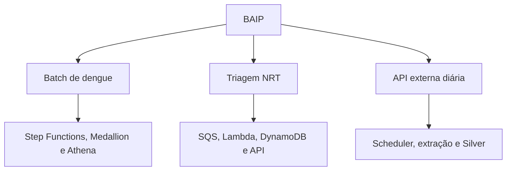

# BAIP — Brazil Arbovirus Intelligence Platform

> Plataforma de Dados e Inteligência Epidemiológica para Arboviroses

O BAIP é um case de Engenharia de Dados em AWS que demonstra como receber,
processar, governar e servir dados epidemiológicos por três padrões de
integração: batch por arquivos, eventos near real-time e ingestão diária de API.

O projeto prioriza decisões justificadas, rastreabilidade, qualidade,
privacidade, segurança, custo e caminhos explícitos de evolução. Ele não se
apresenta como sistema assistencial nem substitui indicadores oficiais.

## Proposta

A plataforma responde a três necessidades de negócio complementares:

| Frente | Necessidade simulada | Resultado | Estado |
|---|---|---|---|
| Batch de dengue | Receber arquivos oficiais ou fornecidos por um parceiro, tratá-los e disponibilizar indicadores confiáveis | Modelo dimensional no S3, catálogo e views Athena | Implementado e validado até o Athena |
| Triagem hospitalar NRT | Disponibilizar indicadores operacionais recentes sem expor PII | API de indicadores com freshness-alvo de até 2 minutos | Planejado |
| API externa diária | Ingerir contexto climático diariamente e disponibilizar dados padronizados | Dataset Silver para exploração e futuros cruzamentos | Planejado |

Os estados acima são deliberados: `implementado` significa que existe código e
evidência executável; `planejado` representa arquitetura aprovada para uma etapa
seguinte; `evolução` é uma alternativa condicionada a volume, SLA ou requisitos
que o MVP ainda não possui.

## Arquitetura em uma visão



O Data Lake utiliza Amazon S3 e arquitetura Medallion. Staging é uma zona de
recebimento temporário; Bronze preserva a fonte; Silver padroniza e valida;
Gold organiza fatos e dimensões para consumo. Nem todas as frentes precisam
percorrer todas as camadas: a API diária termina intencionalmente na Silver.

## Frente 1 — Batch de dengue

O caso representa uma troca governada de arquivos com um órgão público, cliente
ou parceiro que publica extratos periódicos, mas não oferece uma API estável ou
um canal integrado para a plataforma. No MVP, um operador autorizado recebe o
arquivo oficial, confere origem, período e integridade e faz o upload no prefixo
de Staging. A etapa manual é, portanto, um canal de entrada controlado e não uma
alegação de automação inexistente.

Arquivos anuais utilizados:

```text
staging/opendatasus/dengue/reference_year=2024/DENGBR24.csv
staging/opendatasus/dengue/reference_year=2025/DENGBR25.csv
staging/opendatasus/dengue/reference_year=2026/DENGBR26.csv
```

O fluxo implementado é:

```text
CSV oficial -> S3 Staging -> Step Functions
             -> Glue Bronze -> Glue Silver + Quarantine
             -> Glue Gold -> Reconciliação bloqueante
             -> Glue Crawler -> Glue Data Catalog -> Athena
```

Principais conceitos demonstrados:

- schema explícito da fonte e falha rápida para mudanças estruturais;
- metadados de linhagem e preservação da origem;
- conversão de CSV para Parquet/Snappy;
- padronização de nulos, nomes, tipos, datas e domínios;
- enriquecimento de municípios com referência do IBGE;
- identidade técnica determinística com hash;
- separação entre erro de qualidade, alerta e quarentena;
- modelo estrela com grão explícito e medidas aditivas;
- catálogo técnico, consultas SQL e views de consumo;
- infraestrutura AWS versionada em Terraform.

Comece pela [visão ponta a ponta do batch](docs/batch-dengue/README.md). O
[cenário de negócio](docs/cases/01-batch-dengue.md), o
[contrato técnico](docs/data/dengue/README.md) e o
[runbook](docs/operations/dengue-batch-end-to-end.md) detalham responsabilidades
específicas.

## Frente 2 — Triagem hospitalar near real-time

O caso simula hospitais enviando eventos de triagem relacionados a suspeita de
dengue. Todos os dados são sintéticos; nenhum CPF real deve ser usado, salvo no
repositório, enviado a logs ou exibido em dashboards.

O desenho separa o evento identificável dos indicadores de consumo:

```text
Hospital Simulator -> API/ingestão -> SQS -> Lambda NRT
                                         |-> identidade restrita
                                         |-> DynamoDB de indicadores
                                         |-> Firehose/S3 restrito, se necessário

Dashboard -> API Gateway -> Lambda query -> DynamoDB
```

A API é consultável sob demanda. O requisito de dois minutos é um objetivo de
freshness do dado (`event_time` até `available_at`) e não um agendamento da API.
O dashboard pode atualizar a consulta a cada dois minutos.

Detalhes: [Caso NRT de triagem hospitalar](docs/cases/02-nrt-triagem-hospitalar.md).

## Frente 3 — Ingestão diária de API externa

Para demonstrar um padrão diferente sem duplicar toda a arquitetura de dengue,
a terceira frente ingere diariamente dados climáticos do Open-Meteo e termina
na Silver. Temperatura e precipitação são contextos úteis para análises futuras
de arboviroses, mas o MVP não afirma causalidade epidemiológica.

Um adaptador para uma API simulada de Zika pode reutilizar o mesmo padrão, desde
que possua contrato e fonte claramente identificados. Open-Meteo e Zika não são
tratados como a mesma fonte.

```text
EventBridge Scheduler -> Step Functions -> Lambda extractor
                      -> S3 Staging -> transformação -> Silver
```

Detalhes: [Caso de API externa diária](docs/cases/03-api-externa-diaria.md).

## Segurança, privacidade e acesso

O MVP usa uma conta e uma região para controlar custo, com segregação lógica
por buckets, prefixos, databases, roles e tags. A arquitetura produtiva proposta
separa ambientes em contas e aplica governança centralizada.

Papéis lógicos:

| Papel | Acesso esperado |
|---|---|
| Ingestion operator | Escrita somente no prefixo autorizado da Staging; sem leitura da Gold |
| Glue execution role | Leitura e escrita apenas nos paths necessários ao job e nos artefatos |
| Data engineer | Operação de pipelines e leitura técnica controlada; sem acesso irrestrito à identidade NRT |
| Data quality reviewer | Leitura da quarentena e metadados necessários à investigação |
| Athena analyst / BI | `SELECT` apenas nas tabelas e views Gold aprovadas |
| Security auditor | CloudTrail, configurações, logs de auditoria e evidências; sem consumo assistencial |

PII sintética do fluxo NRT deve ser removida ou pseudonimizada o mais cedo
possível. Silver, Gold, Athena, dashboards e logs não recebem identificadores
diretos. Hash técnico de registro não é anonimização de PII: no batch de dengue
ele representa identidade e deduplicação do conteúdo de origem.

Detalhes: [Segurança, LGPD e modelo de acesso](docs/security/access-control-and-pii.md).

## Escalabilidade

O MVP não implementa Multi-Region, EMR, Fargate ou Lake Formation apenas para
parecer maior. A documentação registra limites e gatilhos mensuráveis:

- Glue Auto Scaling e tuning antes de trocar o motor batch;
- EMR quando for necessário controle persistente de Spark, bibliotecas,
  execução longa ou melhor economia em grande escala;
- Fargate para extrações de API maiores que o limite da Lambda, dependências
  pesadas ou fan-out controlado;
- Kinesis/MSK quando houver replay prolongado, ordenação por chave, múltiplos
  consumidores independentes ou throughput incompatível com o desenho SQS;
- Redshift quando concorrência e latência previsível superarem o modelo Athena;
- Lake Formation quando houver múltiplas equipes, dados reais e necessidade de
  controle por linha, coluna ou domínio;
- Multi-Region somente após definição de RTO, RPO, residência e orçamento.

Detalhes: [ADR de processamento batch](architecture/ADR/ADR-003-Processamento-Batch-Glue.md)
e [ADR de formato e particionamento](architecture/ADR/ADR-015-Particionamento-Formato-Arquivos.md).

## Modelo Gold implementado

A fato possui grão de uma linha por notificação Silver válida ou com warning:

```text
fact_dengue_cases
```

Dimensões:

```text
dim_date
dim_location
dim_disease
dim_demographic
dim_clinical
```

O crawler cria no database `baip_dev_gold` as tabelas com prefixo `dengue_`, e
as views Athena oferecem consumo por município, UF, faixa etária e
classificação.

## Organização do repositório

```text
architecture/
├── ADR/
└── c4/

docs/
├── batch-dengue/
├── cases/
├── data/dengue/
├── operations/
└── security/

infra/terraform/
scripts/
src/athena/
src/glue/jobs/
```

## Estado atual e próximos fluxos

O batch de dengue foi executado de ponta a ponta com Step Functions. A
reconciliação fechou Bronze, Silver, quarentena e Gold; o crawler atualizou o
catálogo; e os cinco checks Athena foram aprovados. O resultado sanitizado está
em [Execução validada](docs/batch-dengue/validated-run.md).

As próximas implementações são independentes e terão documentação própria:

1. triagem hospitalar NRT com idempotência, DLQ, indicadores e API;
2. ingestão diária de Open-Meteo até a Silver;
3. ativação e publicação opcional do dashboard QuickSight preparado para as
   views Athena, sem alterar o contrato do batch.

Veja o [índice da documentação](docs/README.md).

## Referências

- [AWS Well-Architected — Data Analytics Lens](https://docs.aws.amazon.com/wellarchitected/latest/analytics-lens/)
- [AWS Glue Auto Scaling](https://docs.aws.amazon.com/glue/latest/dg/auto-scaling.html)
- [Amazon Athena — otimização de dados](https://docs.aws.amazon.com/athena/latest/ug/performance-tuning-data-optimization-techniques.html)
- [AWS Lambda com Amazon SQS](https://docs.aws.amazon.com/lambda/latest/dg/with-sqs.html)
- [Amazon ECS/Fargate networking](https://docs.aws.amazon.com/AmazonECS/latest/developerguide/fargate-task-networking.html)
- [AWS Lake Formation com Athena](https://docs.aws.amazon.com/lake-formation/latest/dg/athena-lf.html)
- [Portal de Dados Abertos do SUS](https://dadosabertos.saude.gov.br/)
- [API de Localidades do IBGE](https://servicodados.ibge.gov.br/api/docs/localidades)
- [Open-Meteo API](https://open-meteo.com/en/docs)
