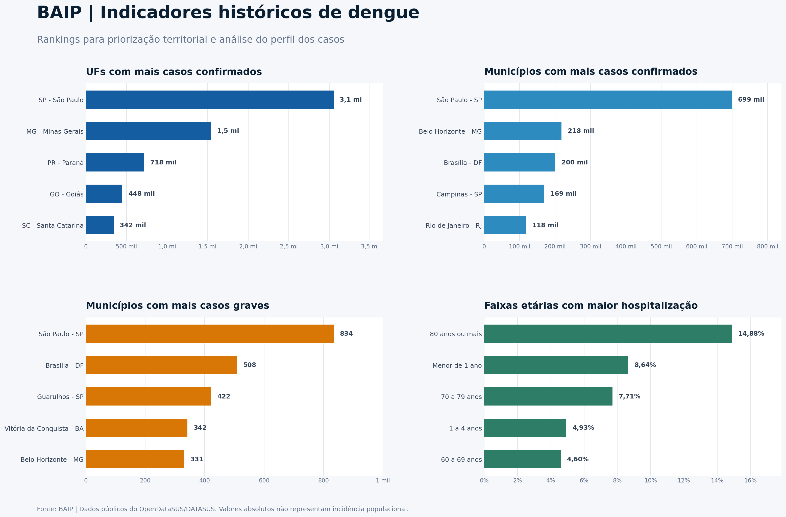
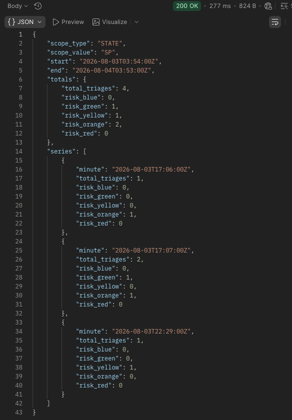
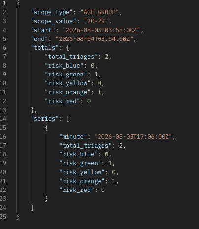
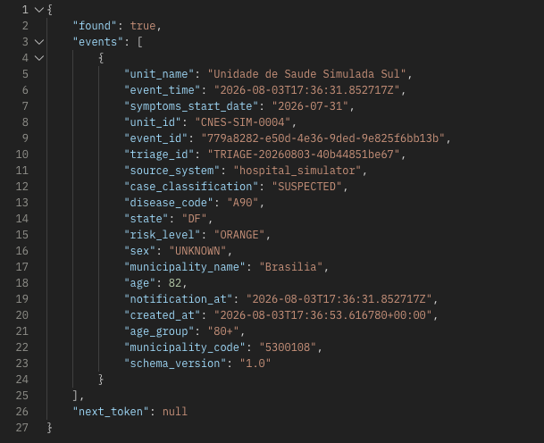
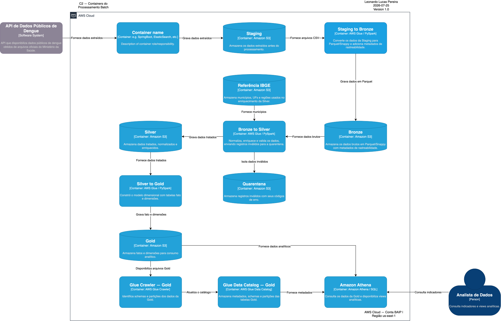
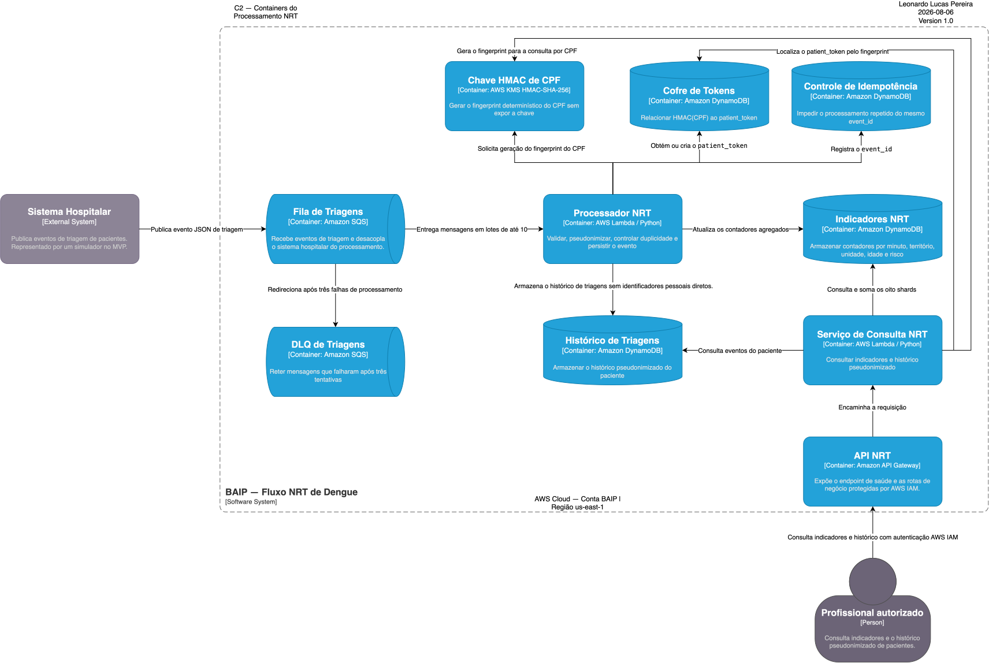

# Data Masters — Trilha de Engenharia de Dados

## BAIP — Brazil Arbovirus Intelligence Platform

### Plataforma de Inteligência Epidemiológica e Assistencial — Caso Dengue

**Autor:** Leonardo Lucas Pereira 
**Formação:** Engenheiro de Computação e especialista em Engenharia de Machine Learning 
**Atuação no projeto:** Arquitetura e desenvolvimento

---

## 1. Objetivo

A **BAIP — Brazil Arbovirus Intelligence Platform** transforma dados históricos de dengue e eventos recentes de triagem em informações para apoiar decisões de saúde pública.

Embora a arquitetura permita incorporar outras arboviroses, o escopo implementado está concentrado na **dengue**.

A plataforma apoia três níveis de decisão:

| Nível           | Decisão apoiada                                                             |
| --------------- | --------------------------------------------------------------------------- |
| **Estratégico** | Priorizar territórios, campanhas preventivas e investimentos                |
| **Tático**      | Planejar equipes, insumos e capacidade hospitalar                           |
| **Operacional** | Monitorar triagens recentes e consultar o histórico autorizado de pacientes |

A solução permite responder:

* onde estão concentrados os maiores volumes de casos;
* quais grupos etários apresentam maior impacto;
* quando ocorre crescimento nas notificações e hospitalizações;
* como as triagens recentes estão distribuídas por território e nível de risco;
* quais regiões podem exigir investigação ou preparação da rede de atendimento.

Para isso, o projeto combina processamento **Batch** e **Near Real-Time**, qualidade de dados, pseudonimização, rastreabilidade, observabilidade e infraestrutura como código.

A BAIP não realiza diagnóstico médico nem prevê epidemias automaticamente. Seus indicadores apoiam a investigação epidemiológica, o planejamento e a alocação de recursos.

> **Em resumo:** a plataforma ajuda a responder **onde agir, quando agir, para quem direcionar os esforços e como preparar a rede de atendimento**.

### 1.1 Evidência de valor — visão histórica

A camada analítica transforma milhões de registros em indicadores para priorização territorial e análise do perfil dos casos.

O painel apresenta:

* UFs com mais casos confirmados;
* municípios com mais casos confirmados;
* municípios com mais casos graves;
* faixas etárias com maior percentual de hospitalização.

Os rankings utilizam valores absolutos e percentuais calculados a partir dos registros disponíveis (01/2024 - 02/2026).

### 1.2 Evidência de valor — indicadores em tempo quase real

O fluxo NRT complementa a análise histórica com indicadores operacionais de triagens processados em tempo quase real.

A API permite acompanhar o volume recente de atendimentos e sua distribuição por nível de risco, utilizando diferentes recortes:

* visão global;
* Unidade Federativa;
* município;
* unidade de atendimento;
* faixa etária;
* período de consulta.

Também é possível consultar o histórico de triagem de um paciente. Essa operação é restrita a usuários autorizados e utiliza o CPF apenas para localizar seu token técnico. A resposta não expõe diretamente CPF, nome, telefone ou e-mail.

#### Endpoints disponíveis

| Método | Endpoint               | Finalidade                                          | Autenticação |
| ------ | ---------------------- | --------------------------------------------------- | ------------ |
| `GET`  | `/health`              | Verificar a disponibilidade da API                  | Pública      |
| `GET`  | `/v1/indicators`       | Consultar indicadores agregados do NRT              | AWS IAM      |
| `POST` | `/v1/patients/history` | Consultar o histórico pseudonimizado de um paciente | AWS IAM      |

#### Indicadores por Unidade Federativa

A consulta por UF permite identificar o volume recente de triagens, sua evolução por minuto e a distribuição dos níveis de risco.

Nesse exemplo, a API apresenta o total de triagens registradas em São Paulo durante o período consultado e sua distribuição entre os níveis de risco.

#### Indicadores por faixa etária

A consulta por faixa etária permite identificar grupos com maior presença nos atendimentos recentes.

Essa visão pode apoiar a avaliação de campanhas direcionadas, a investigação de mudanças no perfil dos atendimentos e a preparação da rede assistencial.

#### Histórico pseudonimizado do paciente

A consulta individual recebe um CPF por meio de uma requisição protegida. A aplicação normaliza o documento, gera uma impressão digital determinística com HMAC no AWS KMS e localiza o token técnico correspondente.

O histórico é retornado sem propagar diretamente os dados pessoais utilizados na busca.

A resposta apresenta informações necessárias para acompanhar os atendimentos, como:

* data e horário da triagem;
* unidade de atendimento;
* município e UF;
* classificação do caso;
* nível de risco;
* faixa etária;
* início dos sintomas.

> Os horários da API são apresentados em UTC, identificados pelo sufixo `Z`. Os indicadores são sinais operacionais para investigação e planejamento e não representam diagnóstico ou confirmação automática de uma epidemia.

Essa combinação permite acompanhar o comportamento recente das triagens e, quando necessário, consultar de forma controlada o histórico de um paciente, conciliando utilidade operacional, rastreabilidade e proteção de dados.

## 2. Escopo do projeto

O escopo principal da BAIP compreende a arquitetura, a infraestrutura e os processos de engenharia de dados executados na AWS. A solução implementa dois fluxos complementares para o caso de dengue.

### 2.1 Fluxo Batch

O fluxo Batch processa dados públicos de notificações de dengue obtidos originalmente no OpenDataSUS/DATASUS. Os arquivos utilizados não contêm informações pessoais diretamente identificáveis.

O processamento contempla:

- extração dos dados por AWS Lambda;
- armazenamento inicial na camada Staging do Amazon S3;
- transformação distribuída com AWS Glue e PySpark;
- organização das camadas Bronze, Silver, Gold e Quarentena;
- aplicação de regras de qualidade e enriquecimento;
- construção do modelo dimensional com fatos e dimensões;
- reconciliação entre as camadas;
- catalogação com AWS Glue Data Catalog;
- disponibilização de views analíticas no Amazon Athena;
- orquestração com AWS Step Functions;
- logs, métricas e alertas com Amazon CloudWatch e Amazon SNS.

A API pública oficial apresentou inconsistências de paginação durante os testes, comprometendo a extração completa e determinística dos dados. Por esse motivo, foi criada uma API local controlada, alimentada pelos arquivos oficiais do DATASUS.

Essa API representa uma fonte externa para o pipeline e está localizada em `api-local/`. Sua implementação não faz parte do escopo avaliativo principal; ela existe para permitir a demonstração reproduzível do processo de extração.

### 2.2 Fluxo NRT — Near Real-Time

O fluxo NRT processa eventos simulados de triagem relacionados a casos suspeitos de dengue.

O processamento contempla:

- recebimento dos eventos pelo Amazon SQS;
- processamento assíncrono com AWS Lambda;
- validação do contrato dos eventos;
- controle de idempotência;
- encaminhamento de mensagens inválidas para uma DLQ;
- pseudonimização do CPF com HMAC no AWS KMS;
- associação entre a impressão digital do CPF e um token técnico;
- armazenamento do histórico e dos indicadores no Amazon DynamoDB;
- aplicação de retenção por TTL;
- disponibilização dos resultados por uma API protegida com AWS IAM;
- monitoramento com Amazon CloudWatch e Amazon SNS.

Os eventos são produzidos por um simulador hospitalar localizado em `api-local/`. Todos os dados pessoais utilizados nesse fluxo são fictícios.

Assim como a API de origem do Batch, o simulador hospitalar deve ser considerado um componente auxiliar de demonstração e não faz parte do escopo avaliativo principal. A avaliação do fluxo NRT concentra-se no recebimento, na proteção, no processamento, no armazenamento e na disponibilização segura dos eventos dentro da AWS.

> [!IMPORTANT]
> Os componentes da pasta `api-local/` existem para fornecer fontes controladas e reproduzíveis durante a demonstração. O núcleo avaliado da plataforma começa na extração ou no recebimento dos dados pela AWS e termina na disponibilização segura das informações para consumo.

---

## 3. Documentação técnica

A documentação técnica apresenta os componentes, as decisões arquiteturais e o funcionamento de cada fluxo da plataforma.

> [!IMPORTANT]
> ### [Documentação do fluxo Batch](docs/batch/README.md)
>
> Descreve a extração, as camadas Staging, Bronze, Silver, Quarentena e Gold, a reconciliação, a catalogação e o consumo pelo Amazon Athena.

> [!IMPORTANT]
> ### [Documentação do fluxo NRT](docs/nrt/README.md)
>
> Descreve a mensageria, o processamento assíncrono, a idempotência, a DLQ, a pseudonimização, o armazenamento no DynamoDB e a API de indicadores.

> [!NOTE]
> ### [Decisões arquiteturais — ADRs](architecture/ADR/)
>
> Registra o contexto, as alternativas avaliadas, as decisões adotadas, seus impactos, limitações e possíveis caminhos de evolução.

### 3.1 Diagramas de arquitetura

> **Evidência a adicionar:** diagrama completo da arquitetura NRT.

<!--

-->

---

## 4. Instalação e utilização

O ambiente pode ser provisionado e demonstrado por meio dos comandos centralizados no `Makefile`.

> [!IMPORTANT]
> ### [Guia de instalação e utilização](docs/usage/installation.md)
>
> Apresenta os pré-requisitos, a configuração das credenciais AWS, o provisionamento com Terraform e a preparação do ambiente local.

> [!NOTE]
> ### [Comandos de demonstração](docs/usage/commands.md)
>
> Reúne os comandos para iniciar a fonte local, publicar o túnel HTTPS, executar o fluxo Batch, produzir eventos NRT, consultar os endpoints e validar os resultados.