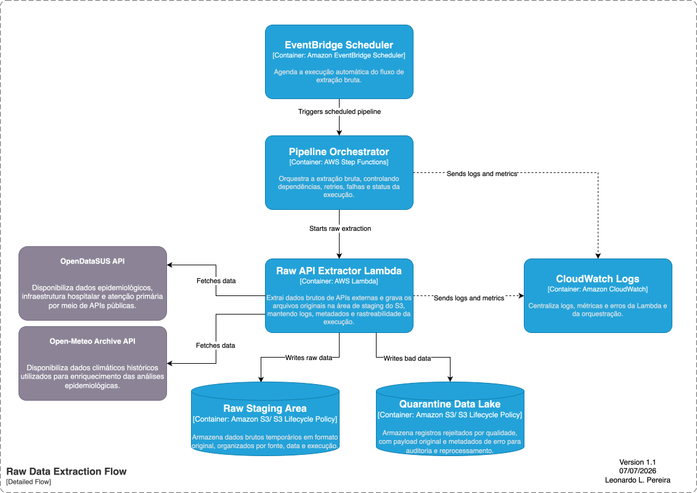
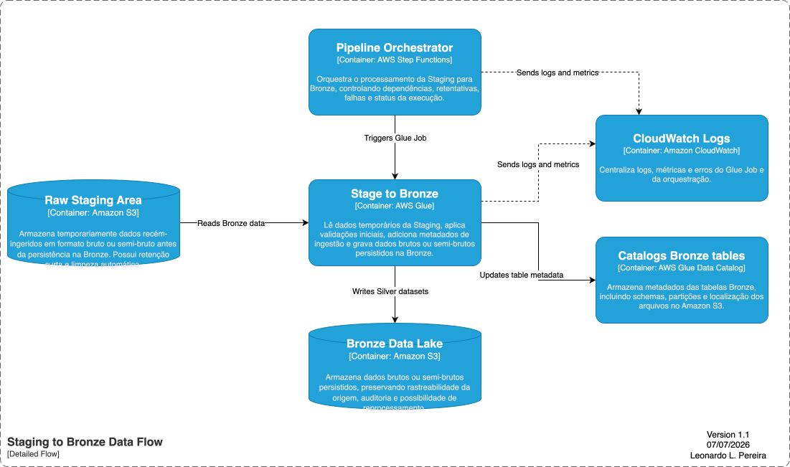
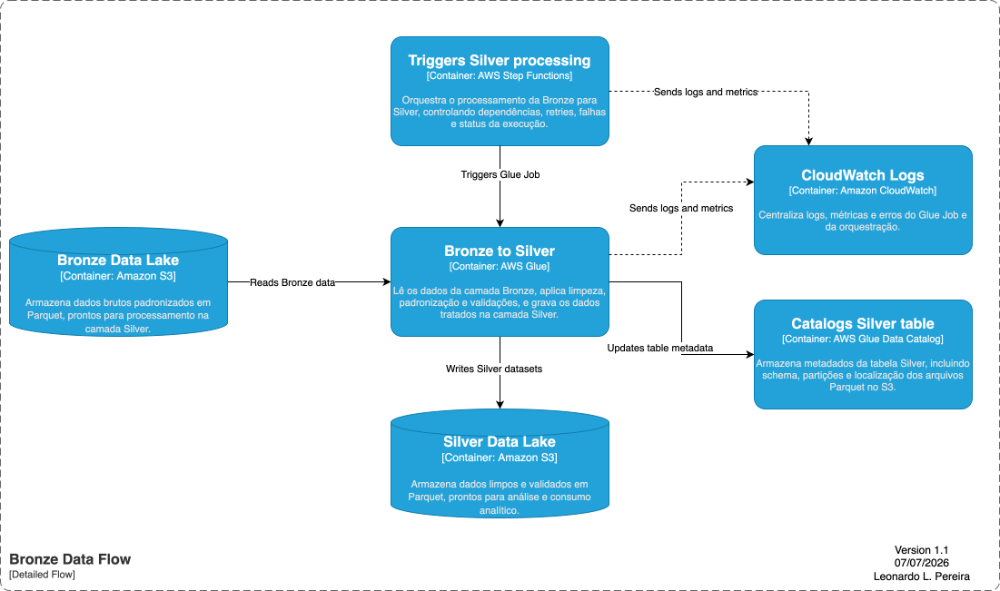
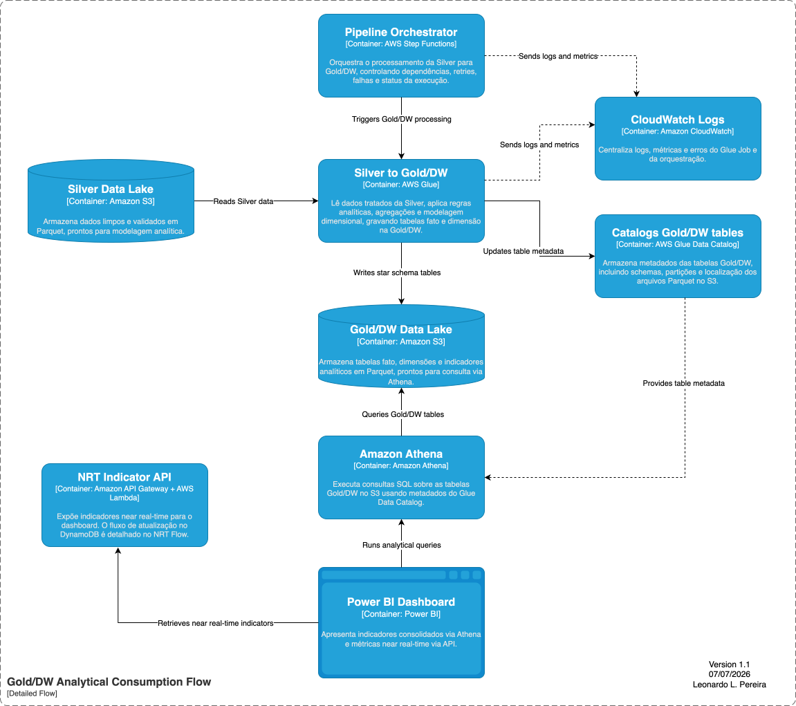
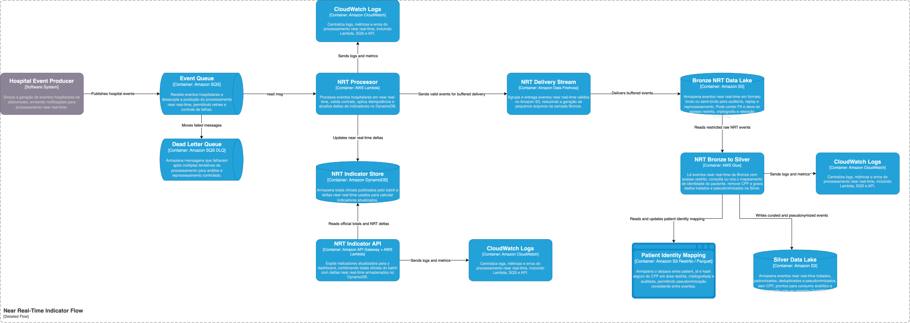

# BAIP - Brazil Arbovirus Intelligence Platform

## Projeto

O objetivo do case é construir uma plataforma de Engenharia de Dados para demonstrar, de forma prática, decisões de arquitetura, governança, LGPD, segurança, processamento batch, processamento near real-time, ETL, modelagem analítica e arquitetura Medallion.

O projeto foi desenhado como um MVP em AWS para representar um cenário realista de dados em saúde pública, com separação entre ingestão, armazenamento bruto, tratamento, consumo analítico e indicadores operacionais near real-time.

## Case

O BAIP utiliza dados da plataforma OpenDataSUS/DATASUS para obter notificações de arboviroses no Brasil.

Para o escopo inicial, serão consideradas três doenças:

- Dengue
- Zika
- Chikungunya

A API disponibiliza dados anuais e paginados por offset. Esses dados serão utilizados no fluxo batch para construir uma base histórica, modelar um DW simples e disponibilizar indicadores no Power BI.

No MVP, a carga batch será considerada até 07/2026. Após essa janela, novas informações incrementais serão demonstradas pelo fluxo stream/near real-time, simulando um hospital enviando eventos de triagem com PII para uma fila SQS.

O fluxo near real-time alimenta indicadores operacionais no DynamoDB, expostos ao Power BI por meio de uma API. A visão oficial e consolidada continua sendo gerada pelo fluxo batch na camada Gold/DW.

## Objetivos técnicos

- Demonstrar arquitetura de dados em AWS.
- Aplicar arquitetura Medallion: Staging, Bronze, Silver e Gold/DW.
- Processar dados batch com AWS Glue.
- Persistir dados em Amazon S3 usando Parquet.
- Consultar dados analíticos com Amazon Athena.
- Consumir indicadores no Power BI.
- Simular ingestão near real-time com SQS, Lambda, Firehose, DynamoDB e API.
- Aplicar conceitos de governança, retenção, qualidade, quarentena e LGPD.
- Modelar um DW simples com fato e dimensões.
- Documentar decisões arquiteturais com ADRs.
- Representar a arquitetura usando diagramas C4.

## Fontes de dados

| Fonte | Doença / Evento | Código do agravo | Tipo de carga |
|---|---|---|---|
| DATASUS / OpenDataSUS | Dengue | A90 | Batch histórico |
| DATASUS / OpenDataSUS | Zika | A928 | Batch histórico |
| DATASUS / OpenDataSUS | Chikungunya | A92. | Batch histórico |
| Hospital Event Simulator | Eventos de triagem | Simulado | Near real-time |

## Arquitetura geral

A arquitetura é dividida em dois fluxos principais:

- **Batch:** responsável por processar os dados históricos oficiais das arboviroses e gerar a camada Gold/DW para consumo analítico.
- **Near real-time:** responsável por simular eventos hospitalares recentes, atualizar indicadores operacionais no DynamoDB e expor esses indicadores via API.


## Fluxo batch

O fluxo batch é responsável por ingerir os dados históricos das APIs de arboviroses, armazenar os dados em camadas do Data Lake, aplicar tratamento e disponibilizar tabelas analíticas para consumo via Athena e Power BI.

### 1. Raw Extract

Extrai dados anuais das APIs do OpenDataSUS/DATASUS utilizando paginação por offset.

Saída esperada:

```text
Dados brutos retornados pela API
```



### 2. Raw Staging Area

Armazena temporariamente o retorno bruto da API no Amazon S3.

Finalidade:

- aterrissagem temporária dos dados;
- suporte a retry;
- rastreabilidade inicial;
- retenção curta;
- separação entre extração e persistência definitiva.

Exemplo de path:

```text
s3://baip-data-lake/staging/health/dengue/year=2026/month=07/
```

### 3. Stage to Bronze

Processa os dados da Staging e grava a primeira camada persistida e auditável do Data Lake.

Responsabilidades:

- leitura dos arquivos brutos;
- validações iniciais;
- inclusão de metadados técnicos;
- conversão para Parquet;
- gravação na Bronze;
- envio de registros inválidos para quarentena, quando aplicável.



### 4. Bronze Data Lake

Armazena dados brutos ou semi-brutos em Parquet, preservando o máximo possível da estrutura original da fonte.

Finalidade:

- auditoria;
- reprocessamento;
- rastreabilidade;
- preservação histórica;
- base para reconstrução das camadas tratadas.

Exemplo de path:

```text
s3://baip-data-lake/bronze/health/dengue/year=2026/month=07/
```

### 5. Bronze to Silver

Transforma os dados brutos em dados tratados e padronizados.

Responsabilidades:

- padronização de nomes e tipos;
- tratamento de `nan` e valores nulos;
- conversão de datas;
- deduplicação;
- aplicação de regras de qualidade;
- envio de registros inválidos para quarentena;
- gravação da Silver em Parquet.



### 6. Silver Data Lake

Armazena dados tratados, padronizados e confiáveis para consumo analítico e geração das tabelas Gold/DW.

Exemplo de tabela:

```text
silver_arbovirus_cases
```

A Silver mantém dados em nível mais detalhado, porém já limpos, tipados e padronizados.

### 7. Silver to Gold/DW

Agrega e modela os dados tratados para consumo pelo Power BI.

Responsabilidades:

- criação de fatos e dimensões;
- agregações por data, doença e localização;
- geração de tabelas otimizadas para Athena;
- atualização do Glue Data Catalog;
- disponibilização da camada analítica oficial.

### 8. Gold/DW

Camada analítica final utilizada pelo Power BI via Athena.

```text
Power BI -> Athena -> Gold/DW
```



## Fluxo near real-time

O fluxo near real-time simula um hospital enviando eventos de triagem com PII. Esses eventos alimentam indicadores operacionais no DynamoDB e também são persistidos no Data Lake para governança, auditoria e posterior tratamento.



### 1. Hospital Event Producer

Simula a geração de eventos hospitalares de triagem.

Exemplo de evento:

```json
{
  "event_id": "evt_001",
  "event_time": "2026-07-07T10:00:00",
  "cpf": "12345678900",
  "disease": "dengue",
  "uf": "SP",
  "municipality_code": "3548906"
}
```

### 2. Event Queue

Recebe eventos hospitalares e desacopla a produção do processamento.

Tecnologia:

```text
Amazon SQS
```

A fila permite absorver picos de eventos, controlar retries e encaminhar falhas para uma DLQ.

### 3. Dead Letter Queue

Armazena mensagens que falharam após múltiplas tentativas de processamento.

Tecnologia:

```text
Amazon SQS DLQ
```

A DLQ permite análise, correção e reprocessamento controlado.

### 4. NRT Processor

Processa eventos em near real-time.

Responsabilidades:

- ler mensagens da SQS;
- validar contrato do evento;
- aplicar idempotência por `event_id`;
- atualizar deltas de indicadores no DynamoDB;
- enviar eventos válidos para o Firehose;
- evitar registro de PII em logs.

### 5. NRT Indicator Store

Armazena indicadores operacionais near real-time.

Tecnologia:

```text
Amazon DynamoDB
```

Exemplo de indicador:

```json
{
  "indicator_key": "DENGUE#UF#SP",
  "official_total": 120000,
  "nrt_delta": 350,
  "total_until_now": 120350,
  "updated_at": "2026-07-07T14:30:00"
}
```

O DynamoDB funciona como camada de serving para indicadores recentes, não como substituto do Data Lake ou do DW.

### 6. NRT Delivery Stream

Entrega eventos válidos no S3 com buffer.

Tecnologia:

```text
Amazon Data Firehose
```

O Firehose é utilizado para reduzir small files, agrupando eventos por tempo ou tamanho antes da gravação na Bronze NRT.

### 7. Bronze NRT Data Lake

Armazena eventos near real-time em formato bruto ou semi-bruto.

A Bronze NRT pode conter PII, como CPF, por ser uma camada bruta de auditoria e replay. Por isso, deve ter acesso restrito, criptografia, retenção controlada e não deve ser exposta para consumo analítico.

### 8. NRT Bronze to Silver

Processa os eventos da Bronze NRT para a Silver.

Responsabilidades:

- ler eventos brutos com acesso restrito;
- consultar ou criar mapeamento de identidade do paciente;
- remover CPF;
- manter `patient_id`;
- padronizar e deduplicar eventos;
- gravar dados tratados na Silver.

### 9. Patient Identity Mapping

Armazena o de/para entre `patient_id` e hash seguro do CPF.

Exemplo:

```json
{
  "patient_id": "pat_001",
  "cpf_hmac": "hmac_sha256_cpf",
  "hash_version": "v1",
  "created_at": "2026-07-07T10:00:00"
}
```

Essa área é restrita, criptografada e auditada. A Silver não deve receber CPF nem `cpf_hmac`.

### 10. NRT Indicator API

Expõe indicadores near real-time para o Power BI.

Tecnologia:

```text
Amazon API Gateway + AWS Lambda
```

A API consulta o DynamoDB e retorna indicadores atualizados para o dashboard.

```text
Power BI -> NRT Indicator API -> DynamoDB
```

## Modelo DW / Gold

Para o MVP, o DW será simples e baseado em uma tabela fato principal e três dimensões.

```text
Gold/DW
├── fact_arbovirus_cases
├── dim_date
├── dim_disease
└── dim_location
```

### Fato

#### `fact_arbovirus_cases`

Grão:

```text
1 linha por data, município e doença
```

Campos principais:

| Campo | Descrição |
|---|---|
| `date_key` | Chave da dimensão de data |
| `disease_key` | Chave da dimensão de doença |
| `location_key` | Chave da dimensão de localização |
| `notification_date` | Data de notificação |
| `year` | Ano |
| `month` | Mês |
| `epidemiological_week` | Semana epidemiológica |
| `uf_code` | Código da UF |
| `municipality_code` | Código do município |
| `disease_code` | Código do agravo/doença |
| `total_cases` | Total de casos |
| `confirmed_cases` | Total de casos confirmados |
| `hospitalized_cases` | Total de hospitalizações |
| `death_cases` | Total de óbitos |
| `updated_at` | Data/hora de atualização |

### Dimensões

#### `dim_disease`

| disease_key | disease_code | disease_name |
|---|---|---|
| A90 | A90 | Dengue |
| A928 | A928 | Zika |
| A92 | A92. | Chikungunya |

#### `dim_location`

| location_key | uf_code | municipality_code | municipality_name |
|---|---|---|---|
| 32-320500 | 32 | 320500 | Não informado no MVP |
| 32-320530 | 32 | 320530 | Não informado no MVP |
| 51-510263 | 51 | 510263 | Não informado no MVP |

> No MVP, o nome do município pode ficar como “Não informado”. Em uma evolução, a dimensão de localização poderá ser enriquecida com dados do IBGE.

#### `dim_date`

| date_key | date | year | month | month_name | epidemiological_week |
|---:|---|---:|---:|---|---|
| 20251223 | 2025-12-23 | 2025 | 12 | Dezembro | 202552 |
| 20160101 | 2016-01-01 | 2016 | 1 | Janeiro | 201552 |
| 20160224 | 2016-02-24 | 2016 | 2 | Fevereiro | 201608 |

## Amostra final da fact

| date_key | notification_date | year | month | epidemiological_week | uf_code | municipality_code | disease_code | total_cases | confirmed_cases | hospitalized_cases | death_cases |
|---:|---|---:|---:|---|---|---|---|---:|---:|---:|---:|
| 20251223 | 2025-12-23 | 2025 | 12 | 202552 | 32 | 320500 | A90 | 4 | 4 | 0 | 0 |
| 20251223 | 2025-12-23 | 2025 | 12 | 202552 | 32 | 320530 | A90 | 2 | 2 | 0 | 0 |
| 20160101 | 2016-01-01 | 2016 | 1 | 201552 | 32 | 320530 | A928 | 4 | 3 | 0 | 0 |
| 20160224 | 2016-02-24 | 2016 | 2 | 201608 | 51 | 510263 | A92. | 3 | 3 | 0 | 0 |

## Consumo no Power BI

O Power BI consome os dados oficiais pela camada Gold/DW via Athena.

```text
Power BI -> Athena -> fact_arbovirus_cases
```

Também pode consultar a NRT Indicator API para indicadores near real-time.

```text
Power BI -> NRT Indicator API -> DynamoDB
```

### Indicadores iniciais

- Total de casos de arboviroses.
- Total de casos por doença.
- Total de casos por mês.
- Total de casos por UF.
- Total de casos por município.
- Total de hospitalizações.
- Total de óbitos.
- Última atualização.

### Visões do dashboard

- Cards de totais.
- Evolução mensal de casos.
- Casos por doença.
- Casos por UF.
- Top municípios com mais casos.
- Filtros por ano, mês, doença, UF e município.

## Estrutura C4

Os diagramas C4 ficam na pasta:

```text
architecture/c4
```

Fluxos principais:

| Fluxo | Pasta |
|---|---|
| Contexto do sistema | `architecture/c4/c1_context` |
| Extração raw | `architecture/c4/1_raw_extract` |
| Staging para Bronze | `architecture/c4/2_staging_to_bronze` |
| Bronze para Silver | `architecture/c4/3_bronze_to_silver` |
| Silver para Gold/DW | `architecture/c4/4_Silver_to_gold` |
| Near Real-Time | `architecture/c4/6_NRT` |

## Segurança e LGPD

- Dados pessoais não devem ser propagados para Silver, Gold/DW, Athena, Power BI ou logs.
- A Bronze NRT pode conter PII apenas com acesso restrito, criptografia e retenção controlada.
- O CPF deve ser removido antes da Silver.
- A identificação técnica do paciente deve ser feita por `patient_id`.
- O mapeamento `patient_id` x `cpf_hmac` deve ficar em área restrita.
- Logs não devem armazenar CPF, payload sensível ou dados pessoais.

## Qualidade e quarentena

Registros inválidos devem ser enviados para uma área de quarentena no S3.

A quarentena deve armazenar:

- payload original;
- regra violada;
- motivo do erro;
- fonte;
- data de processamento;
- identificador do batch.

## Referências

- Arquitetura do projeto: https://github.com/lleonardo-p/data_masters/tree/architecture/architecture
- ADRs: https://github.com/lleonardo-p/data_masters/tree/architecture/architecture/ADR
- Diagramas C4: https://github.com/lleonardo-p/data_masters/tree/architecture/architecture/c4
