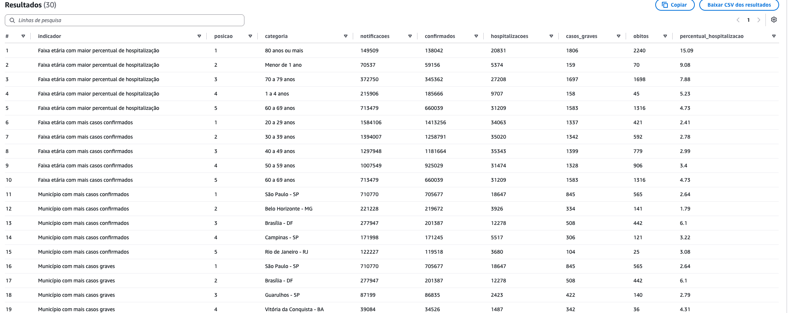

# Data Masters — Trilha de Engenharia de Dados

## BAIP — Brazil Arbovirus Intelligence Platform

### Plataforma de Inteligência Epidemiológica e Assistencial — Caso Dengue

**Autor:** Leonardo Lucas Pereira 
**Formação:** Engenheiro de Computação e especialista em Engenharia de Machine Learning 
**Atuação no projeto:** Arquitetura e desenvolvimento

---

## 1. Objetivo

A **BAIP — Brazil Arbovirus Intelligence Platform** é uma plataforma de inteligência epidemiológica e assistencial criada para transformar dados de arboviroses em informações acionáveis para gestores e profissionais autorizados.

Embora sua arquitetura permita a incorporação de outras arboviroses, o escopo implementado neste projeto está concentrado na **dengue**. A solução combina dados históricos de notificações com eventos recentes de triagem para reduzir o tempo entre a ocorrência dos casos, a identificação de mudanças no cenário e a tomada de decisão.

A plataforma apoia três níveis de decisão:

| Nível           | Decisão apoiada                                                                                                   |
| --------------- | ----------------------------------------------------------------------------------------------------------------- |
| **Estratégico** | Priorizar municípios, regiões, campanhas preventivas e investimentos em saúde                                     |
| **Tático**      | Planejar equipes, insumos, unidades de atendimento e capacidade hospitalar                                        |
| **Operacional** | Monitorar triagens recentes, identificar concentrações de risco e consultar o histórico autorizado de um paciente |

Com as informações disponibilizadas, a plataforma permite identificar:

* os municípios e UFs com maior concentração de notificações;
* os períodos com crescimento de casos, hospitalizações e ocorrências graves;
* as faixas etárias e os grupos mais impactados;
* as regiões que podem exigir campanhas preventivas ou investigação epidemiológica;
* o aumento recente da procura por triagem;
* a distribuição dos atendimentos por região, unidade e nível de risco;
* o histórico de triagem de um paciente, mediante acesso autorizado e sem exposição direta de seus dados pessoais nas tabelas operacionais.

Além do valor para o negócio, o projeto demonstra a aplicação prática de conceitos de engenharia de dados, incluindo processamento Batch e Near Real-Time, arquitetura de dados, qualidade, segurança, pseudonimização, rastreabilidade, observabilidade, escalabilidade e infraestrutura como código.

A plataforma não realiza diagnóstico médico nem prevê automaticamente a ocorrência de uma epidemia. Ela funciona como um sistema de apoio à decisão, utilizando padrões históricos e sinais operacionais recentes para orientar investigação, planejamento e preparação da rede de atendimento.

> **Em resumo:** a solução ajuda a responder **onde agir, quando agir, para quem direcionar os esforços e como preparar a rede de atendimento**, utilizando dados confiáveis, rastreáveis e protegidos.

### 1.1 Evidência de valor — visão histórica consolidada

A camada analítica transforma milhões de registros processados em rankings que apoiam a priorização de territórios e grupos populacionais.

O exemplo abaixo apresenta:

* faixas etárias com maior percentual de hospitalização;
* faixas etárias com maior número de casos confirmados;
* municípios com maior número de casos confirmados;
* municípios com maior número de casos graves;
* indicadores de hospitalizações e óbitos.

Essa visão oferece respostas objetivas para o direcionamento de campanhas, a investigação epidemiológica e a preparação da rede de atendimento.
