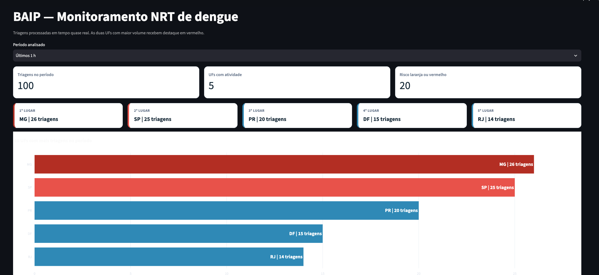

# Data Masters — Trilha de Engenharia de Dados

## BAIP — Brazil Arbovirus Intelligence Platform

### Plataforma de Inteligência Epidemiológica e Assistencial — Caso Dengue

**Autor:** Leonardo Lucas Pereira 
**Formação:** Engenheiro de Computação e especialista em Engenharia de Machine Learning 
**Atuação no projeto:** Arquitetura e desenvolvimento

---

## Visão geral da entrega

A BAIP foi construída com **13 serviços AWS**, compartilhados entre os fluxos Batch e NRT. Toda a infraestrutura AWS foi declarada e provisionada com **Terraform**, permitindo reproduzir o ambiente e manter suas configurações versionadas.

| Resultado | Entrega |
|---|---|
| **13 serviços AWS** | S3, Glue, Athena, Lambda, Step Functions, SQS, DynamoDB, API Gateway, KMS, CloudWatch, SNS, Secrets Manager e IAM |
| **Infraestrutura como código** | Recursos, permissões, configurações e integrações provisionados com Terraform |
| **8.287.799 registros históricos** | Registros recebidos na camada Bronze entre janeiro de 2024 e fevereiro de 2026 |
| **8.227.642 registros analíticos** | Registros tratados e disponibilizados na camada Gold |
| **60.157 registros em quarentena** | Registros isolados por não atenderem às regras obrigatórias de qualidade |
| **Reconciliação automatizada** | Validação de volumes, identidade do lote, duplicidade, medidas e integridade referencial |
| **Indicadores NRT por API** | Triagens recentes disponibilizadas por território, faixa etária e nível de risco |
| **Proteção de dados pessoais** | CPF pseudonimizado com HMAC no AWS KMS e histórico protegido por AWS IAM |

A reconciliação do processamento histórico foi concluída com todas as verificações aprovadas:

- igualdade entre Bronze, Silver e Quarentena;
- correspondência entre Silver e Gold;
- ausência de duplicidade na granularidade da tabela fato;
- ausência de chaves estrangeiras órfãs;
- validade das medidas analíticas;
- consistência da identidade do lote.

No fluxo NRT, eventos sintéticos de triagem são processados de forma idempotente e transformados em indicadores operacionais. Os resultados são disponibilizados por uma API protegida, permitindo o monitoramento agregado e a consulta autorizada do histórico pseudonimizado de pacientes sintéticos.

---

## 1. Objetivo

A **BAIP — Brazil Arbovirus Intelligence Platform** transforma dados de dengue em informações para apoiar decisões de saúde pública.

A plataforma oferece duas visões complementares:

- **análise histórica:** identifica os territórios e grupos mais impactados, além da evolução de casos, hospitalizações e ocorrências graves;
- **monitoramento ativo:** acompanha triagens recentes por território, unidade, faixa etária e nível de risco.

Com essas informações, gestores e profissionais autorizados podem priorizar investigações, campanhas preventivas, equipes, insumos e capacidade hospitalar.

A BAIP não realiza diagnóstico médico nem prevê epidemias automaticamente. Seus indicadores apoiam a análise do cenário e a preparação da rede de atendimento.

> **Em resumo:** a plataforma ajuda a responder **onde agir, quando agir, para quem direcionar os esforços e como preparar a rede de atendimento**.

### 1.1 Visão histórica

O painel apresenta os territórios e grupos com maior impacto nos registros processados entre janeiro de 2024 e fevereiro de 2026.

Os rankings utilizam valores absolutos e percentuais calculados a partir dos dados disponíveis.

### 1.2 Monitoramento NRT

O painel NRT apresenta triagens processadas em tempo quase real, permitindo acompanhar o volume recente de atendimentos por UF e nível de risco.

A visualização destaca:

- as UFs com maior volume de triagens;
- a quantidade total de triagens no período;
- o número de UFs com atividade;
- os atendimentos classificados com risco laranja ou vermelho;
- a distribuição das triagens entre os diferentes níveis de risco.

Os indicadores podem apoiar a identificação de mudanças recentes na procura por atendimento e orientar a investigação e a preparação da rede assistencial.

> [!NOTE]
> Os indicadores NRT desta demonstração são produzidos exclusivamente a partir de eventos sintéticos. Eles não representam diagnóstico médico nem confirmação automática de epidemia.

---

## 2. Fluxos da plataforma

A BAIP contempla dois fluxos de processamento: **Batch** e **Near Real-Time**. As decisões adotadas estão registradas nos [Architecture Decision Records](architecture/ADR/).

Embora alguns serviços sejam compartilhados, cada fluxo possui responsabilidades e características próprias.

### 2.1 Fluxo Batch

O fluxo Batch consome dados históricos de dengue por meio de uma API alimentada com arquivos oficiais do DATASUS.

Os registros percorrem etapas de extração, armazenamento, tratamento, qualidade, modelagem e reconciliação até serem disponibilizados em views analíticas.

**Principais serviços AWS:** Amazon S3, AWS Lambda, AWS Glue, AWS Step Functions, Amazon Athena, Amazon CloudWatch, Amazon SNS, AWS Secrets Manager e AWS IAM.

> [!IMPORTANT]
> [Acessar a documentação do fluxo Batch](docs/batch/README.md)

---

### 2.2 Fluxo NRT — Near Real-Time

O fluxo NRT recebe eventos sintéticos de triagem publicados por um simulador de sistema hospitalar.

Os eventos são enviados para uma fila de mensagens, validados, processados de forma idempotente e pseudonimizados antes de serem armazenados.

O fluxo produz indicadores operacionais por território, unidade, faixa etária e nível de risco. A plataforma também permite a consulta autorizada do histórico de triagem de um paciente sintético sem expor diretamente CPF, nome, telefone ou e-mail nas tabelas operacionais.

**Principais serviços AWS:** Amazon SQS, AWS Lambda, Amazon DynamoDB, AWS KMS, Amazon API Gateway, Amazon CloudWatch, Amazon SNS e AWS IAM.

> [!IMPORTANT]
> [Acessar a documentação do fluxo NRT](docs/nrt/README.md)

<!--
Adicionar o diagrama quando o arquivo final estiver disponível:

-->

---

## 3. Considerações

As limitações do MVP, os componentes locais de demonstração, as fontes dos dados, as possibilidades de evolução, o plano de recuperação de desastre e a estimativa de custos estão documentados separadamente.

> [!NOTE]
> [Acessar as considerações do projeto](docs/considerations/README.md)

---

## 4. Instalação e utilização

O ambiente pode ser provisionado e demonstrado por meio dos comandos documentados no projeto.

> [!IMPORTANT]
> [Acessar o guia de instalação](docs/usage/installation.md)

> [!NOTE]
> [Acessar os comandos de demonstração](docs/usage/commands.md)