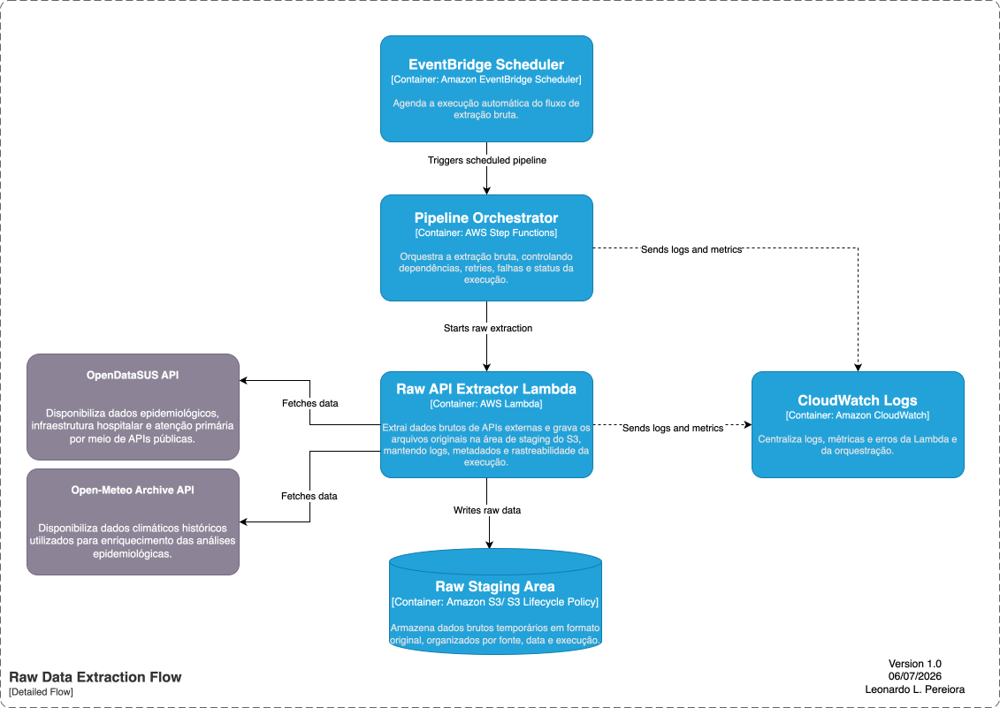
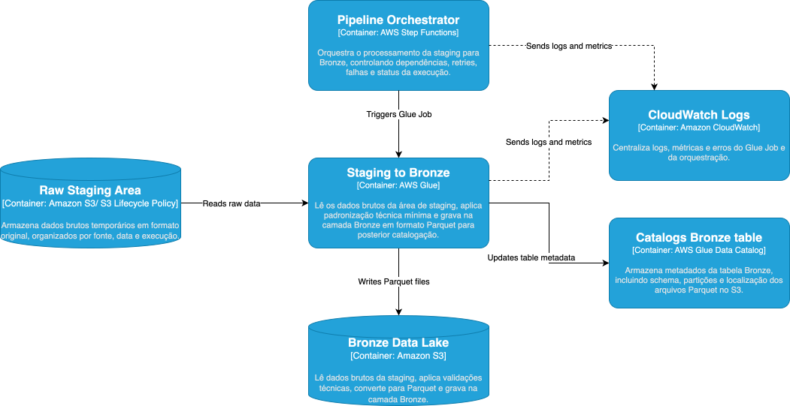

# Arquitetura Técnica

O projeto consiste em dois fluxos de dados: **batch** e **NRT**. O fluxo batch será executado a cada 1 dia, com possibilidade de **backfill** para reprocessamento histórico. Os dados serão organizados em uma arquitetura medalhão, com zonas **Staging**, **Bronze**, **Silver** e **Gold/DW**. A área de Staging armazenará dados brutos temporários e terá política de deleção/retenção. As camadas analíticas serão catalogadas no **AWS Glue Data Catalog** e consultadas via **Amazon Athena** para consumo no **Power BI**.

## Fluxo Batch

O fluxo batch é responsável por extrair, armazenar, transformar e disponibilizar os dados para análise. A execução é agendada pelo **Amazon EventBridge Scheduler** e orquestrada pelo **AWS Step Functions**, garantindo controle de dependências, retries, falhas e status da execução.

### Etapa de Extração Bruta

A etapa de extração bruta inicia com o agendamento automático do pipeline pelo **EventBridge Scheduler**. Em seguida, o **AWS Step Functions** orquestra a execução da **Raw API Extractor Lambda**, responsável por consultar APIs externas, como OpenDataSUS e Open-Meteo Archive API.

A Lambda busca os dados nas APIs, mantém os registros no formato original e grava os arquivos na **Raw Staging Area** no Amazon S3. Essa área é temporária, organizada por fonte, data e execução, e possui política de retenção/deleção via **S3 Lifecycle Policy**. Logs, métricas e erros da orquestração e da Lambda são centralizados no **Amazon CloudWatch Logs**.

### Camada Bronze

A camada Bronze recebe os dados brutos da **Raw Staging Area** e realiza a primeira padronização técnica. O **Staging to Bronze Glue Job** lê os arquivos originais, aplica validações mínimas, converte os dados para **Parquet** e grava o resultado no **Bronze Data Lake** no Amazon S3.

Essa camada mantém os dados ainda próximos da origem, porém em formato otimizado, particionado e preparado para catalogação no **AWS Glue Data Catalog**. Logs, métricas e erros do Glue Job são enviados para o **Amazon CloudWatch Logs**.

### Camada Silver
