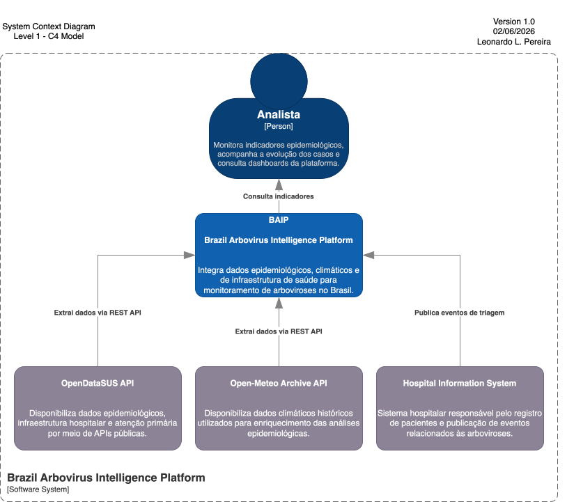

# O que é o BAIP?

O **BAIP (Brazil Arbovirus Intelligence Platform)** é um projeto de Engenharia de Dados desenvolvido para demonstrar a construção de uma plataforma moderna de dados voltada ao monitoramento de arboviroses no Brasil.

O projeto tem como objetivo integrar diferentes fontes públicas de dados relacionadas à saúde, clima e infraestrutura hospitalar em uma única plataforma analítica, permitindo a extração, ingestão, consolidação, transformação e disponibilização de informações para análises epidemiológicas e geração de indicadores.

Além da análise de dados históricos, o BAIP contempla um cenário simulado de integração com Sistemas de Informação (SI) hospitalares, onde novos atendimentos de pacientes com suspeita de arboviroses são registrados durante a triagem e publicados como eventos para processamento em tempo real.

A plataforma também prevê a correlação entre dados epidemiológicos, condições climáticas e infraestrutura de saúde, permitindo análises mais abrangentes sobre a evolução das arboviroses e servindo como base para futuras iniciativas de predição de surtos epidemiológicos.

---

## Objetivos

O BAIP foi concebido para simular uma plataforma corporativa de Engenharia de Dados, permitindo demonstrar conceitos, padrões arquiteturais e boas práticas utilizados na construção de soluções modernas de dados.

Entre os principais objetivos do projeto estão:

- Construção de pipelines de ingestão de dados batch e streaming;
- Extração e integração de dados provenientes de múltiplas APIs públicas e sistemas transacionais;
- Implementação de uma arquitetura **Lakehouse** utilizando o padrão **Medallion** (Bronze, Silver e Gold);
- Construção de um **Data Warehouse** utilizando modelagem dimensional para suporte às análises;
- Processos de ETL/ELT e enriquecimento de dados;
- Observabilidade e monitoramento de pipelines de dados;
- Governança, catálogo e qualidade de dados;
- Segurança, anonimização e mascaramento de dados sensíveis (PII) em conformidade com a LGPD;
- Disponibilização de dados para consumo por dashboards, APIs e futuras aplicações de Machine Learning.

Embora desenvolvido como um projeto de estudo e portfólio, o BAIP busca reproduzir desafios encontrados em ambientes corporativos, explorando todo o ciclo de vida de uma plataforma moderna de Engenharia de Dados.

# System Context

