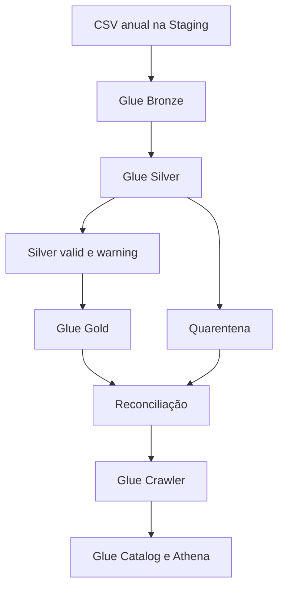

# Batch de dengue — visão ponta a ponta

Este é o documento principal do batch de dengue. Ele conecta o cenário de
negócio, o fluxo de dados, os recursos AWS, o código do repositório e a rotina
operacional.

## 1. Resultado entregue

O fluxo recebe arquivos anuais do SINAN/OpenDataSUS, preserva a origem,
padroniza e valida os registros, enriquece municípios com o IBGE, cria um
modelo dimensional e disponibiliza tabelas e views no Athena.

O escopo implementado termina no produto analítico consultável no Athena. Um
dashboard pode consumir as views sem exigir mudança no pipeline.

## 2. Cenário de negócio

O envio manual representa uma troca governada de arquivos com um órgão,
cliente ou parceiro que publica lotes fechados e não oferece integração estável.
O operador autorizado verifica origem, ano, nome e integridade antes de gravar
o arquivo na Staging.

Essa entrada não é uma limitação da arquitetura Medallion: o canal pode evoluir
para Transfer Family, DataSync ou upload pré-assinado sem alterar os contratos
das camadas posteriores.

## 3. Fontes

| Fonte | Conteúdo | Uso |
|---|---|---|
| SINAN/OpenDataSUS | Notificações anuais de dengue | Fonte principal |
| Dicionário e ficha SINAN | Domínios e interpretação dos campos | Regras Silver |
| API de Localidades do IBGE | Município, UF e região | Enriquecimento geográfico |

Arquivos carregados:

```text
DENGBR24.csv  6.564.924 registros
DENGBR25.csv  1.644.938 registros
DENGBR26.csv    407.750 registros
Total         8.617.612 registros
```

Os três arquivos possuem 121 colunas no mesmo contrato estrutural.

## 4. Arquitetura executada



A Step Functions coordena Bronze, Silver, Gold, reconciliação e crawler. O nome
da execução é propagado como `batch_id`. Cada etapa Glue usa integração
síncrona: a próxima etapa somente começa quando a anterior termina com sucesso.

A state machine é persistente, mas não recorrente. O processamento começa por
uma chamada explícita de `start-execution`, adequada à chegada manual do lote.
Um agendamento só deve ser adicionado quando existir uma entrega recorrente com
calendário e SLA definidos.

## 5. Responsabilidade de cada etapa

| Etapa | Entrada | Responsabilidade | Saída |
|---|---|---|---|
| Staging | CSV recebido | Preservar o arquivo entregue e seu ano de referência | CSV imutável por convenção |
| Bronze | CSV | Validar o schema estrutural, normalizar nomes e converter para Parquet/Snappy | Dados brutos tipados como string e metadados técnicos |
| Silver | Bronze + IBGE | Tipar, padronizar, traduzir domínios, enriquecer, gerar identidade e aplicar qualidade | Registros `valid`/`warning` e quarentena |
| Gold | Silver | Modelar uma fato e cinco dimensões | Modelo estrela em Parquet/Snappy |
| Reconciliação | Bronze, Silver, quarentena e Gold | Fechar contagens, lote, grão, chaves e medidas | Manifesto JSON bloqueante |
| Crawler | Gold aprovada | Atualizar tabelas e partições no Glue Catalog | Seis tabelas no database Gold |
| Athena | Glue Catalog | Executar views, consultas analíticas e checks de aceitação | Produto SQL para consumidores |

## 6. Layout do Data Lake

```text
staging/opendatasus/dengue/reference_year=<YYYY>/DENGBRYY.csv
bronze/opendatasus/dengue/
silver/opendatasus/dengue/cases/
quarantine/opendatasus/dengue/silver_cases/
gold/opendatasus/dengue/
reference/ibge/municipalities/municipios_ufs_ibge.json
```

Partições:

| Dataset | Partições |
|---|---|
| Bronze | `disease/reference_year/notification_year/notification_month` |
| Silver | `disease_name/source_reference_year/notification_year/notification_month` |
| Quarentena | `primary_error_code/source_reference_year/quarantine_year/quarantine_month` |
| Fato Gold | `notification_year/notification_month` |

`reference_year` representa a edição anual do arquivo. `notification_year` e
`notification_month` representam a data do evento. A diferença entre os dois
é preservada e pode produzir warning.

## 7. Linhagem e identidade

- `_batch_id` nasce na Bronze com o nome da execução da Step Functions;
- `source_batch_id` segue pela Silver e pela fato Gold;
- `record_hash` é SHA-256 sobre as colunas de negócio da fonte;
- `record_id` combina sistema, ano de referência e hash;
- metadados de carga e `batch_id` não participam do hash.

Assim, o lote é rastreável sem alterar a identidade determinística do registro
em um reprocessamento.

## 8. Qualidade e quarentena

A Silver possui três resultados:

| Status | Destino | Significado |
|---|---|---|
| `valid` | Silver e Gold | Registro atende às regras implementadas |
| `warning` | Silver e Gold | Registro utilizável com limitação explícita |
| `quarantined` | Quarentena | Erro bloqueante; não entra na Gold |

Exemplos bloqueantes: doença desconhecida, data crítica inválida, município de
residência não localizado, identidade de origem incompleta, duplicata exata e
cronologia inconsistente. A fonte é preservada; o job não corrige silenciosamente
um valor para fazê-lo passar.

Warnings incluem ausência ou domínio não mapeado em atributos analíticos não
críticos, como classificação, critério, evolução e alguns papéis geográficos.

O contrato completo está em [Contrato técnico de dengue](../data/dengue/README.md).

## 9. Modelo Gold

Grão da fato: uma linha por `record_id` Silver válido ou com warning.

Tabelas catalogadas:

```text
dengue_fact_dengue_cases
dengue_dim_date
dengue_dim_location
dengue_dim_disease
dengue_dim_demographic
dengue_dim_clinical
```

As medidas da fato são aditivas em 0/1, incluindo notificações, confirmações,
descartes, hospitalizações, óbitos, gravidade e warning de qualidade.

Views de consumo:

```text
vw_dengue_cases_enriched
vw_dengue_monthly_municipality
vw_dengue_monthly_uf
vw_dengue_monthly_age_group
vw_dengue_monthly_classification
```

As views são assets SQL versionados e são implantadas fora da Step Functions
por `scripts/deploy_athena_dengue_views.sh`. Elas devem ser executadas na criação
do ambiente ou quando o SQL de uma view mudar; não precisam ser recriadas a cada
batch.

## 10. Reconciliação

O crawler só é iniciado quando todos os checks abaixo passam:

```text
Bronze = Silver + quarentena do batch atual
Gold = Silver
Silver = valid + warning
case_id é único
chaves dimensionais são únicas
fato não possui chaves órfãs
medidas são binárias e notification_count = 1
batch_id é consistente entre as camadas
```

O relatório é escrito em:

```text
s3://<logs-bucket>/pipeline-runs/dengue-batch/reconciliation/
└── batch_id=<batch_id>/reconciliation.json
```

Se um check falhar, o manifesto registra `FAILED`, o job falha e o catálogo não
é atualizado com um snapshot não aprovado.

## 11. Como operar

O caminho recomendado é o comando unificado:

```bash
./scripts/dengue_batch.sh start
./scripts/dengue_batch.sh status
./scripts/dengue_batch.sh manifest
./scripts/dengue_batch.sh validate
./scripts/dengue_batch.sh history
```

Na primeira criação do ambiente, ou após mudar uma view:

```bash
./scripts/deploy_athena_dengue_views.sh
```

O comando recupera state machine, lote e bucket diretamente da AWS/Terraform,
evitando depender de variáveis antigas no terminal. Os comandos manuais e o
deploy estão no [runbook operacional](../operations/dengue-batch-end-to-end.md).

## 12. Sobrescrita e reprocessamento

- Staging e referência IBGE não são alteradas pelos jobs;
- Bronze e Silver usam overwrite dinâmico das partições produzidas;
- Gold recria fato e dimensões como snapshot;
- a quarentena pode preservar lotes anteriores, mas a reconciliação conta
  apenas o `source_batch_id` atual;
- duas execuções concorrentes não são permitidas no MVP porque escreveriam nos
  mesmos paths de snapshot.

Em falha, corrija a causa e inicie uma execução completa com novo nome. Não
misture a execução orquestrada com jobs manuais usando outro `batch_id`.

## 13. Observabilidade e alertas

- logs e métricas dos jobs ficam no CloudWatch;
- a Step Functions registra o estado e a duração das etapas;
- três alarmes monitoram execução falha, expirada ou cancelada;
- os alarmes publicam no tópico SNS do batch;
- o SNS precisa de uma assinatura confirmada para entregar e-mail ou outro
  destino.

## 14. Segurança

O batch trabalha com dados públicos e não publica identificadores diretos na
Gold. O hash do registro serve para identidade técnica, não para anonimização.
Buckets bloqueiam acesso público e a execução ocorre por roles IAM. Analistas e
BI devem consultar apenas as tabelas e views Gold autorizadas.

## 15. Escalabilidade e limites

O desenho atual usa dois workers `G.1X` por job Glue e snapshots completos. O
primeiro caminho de escala é medir duração, shuffle, skew, tamanho de arquivo e
DPU-seconds; depois ajustar workers, Auto Scaling e particionamento.

EMR passa a ser alternativa quando houver necessidade mensurável de runtime
customizado, workloads Spark contínuos ou economia comprovada. Escrita imutável
por lote, lock distribuído e promoção atômica substituem o bloqueio operacional
quando houver múltiplos produtores ou execuções concorrentes.

## 16. Onde está o código

| Componente | Local no repositório |
|---|---|
| Bronze | `src/glue/jobs/bronze_ingestion/bronze_ingestion.py` |
| Silver | `src/glue/jobs/silver_dengue_cases/silver_dengue_cases.py` |
| Gold | `src/glue/jobs/gold_dengue_star_schema/gold_dengue_star_schema.py` |
| Reconciliação | `src/glue/jobs/reconcile_dengue_batch/reconcile_dengue_batch.py` |
| Step Functions, IAM e alarmes | `infra/terraform/environments/dev/dengue_batch_orchestration.tf` |
| Jobs, buckets, crawler e catálogo | `infra/terraform/environments/dev/main.tf` |
| Views | `src/athena/dengue/views/` |
| Consultas analíticas | `src/athena/dengue/queries/` |
| Checks | `src/athena/dengue/validation/` |
| Operação | `scripts/dengue_batch.sh` |

## 17. Definição de pronto do batch

O backend analítico do batch é considerado completo quando:

- [x] os arquivos anuais e a referência IBGE estão na Staging/reference;
- [x] a infraestrutura está aplicada por Terraform;
- [x] a Step Functions conclui Bronze, Silver e Gold;
- [x] a reconciliação fecha as camadas e publica manifesto `SUCCEEDED`;
- [x] o crawler atualiza as seis tabelas do Glue Catalog;
- [x] as cinco views estão implantadas no Athena;
- [x] os cinco checks de aceitação retornam `PASS`;
- [x] código, contratos, operação e evidência estão documentados.

O dashboard é um consumidor downstream das views e não faz parte da definição
de pronto do pipeline de dados.

## 18. Evidência reproduzível

A execução de referência e suas contagens estão em
[Execução validada](validated-run.md). Ela documenta o fechamento entre camadas
e os checks Athena sem armazenar dados do lake, credenciais ou arquivos de
state.
