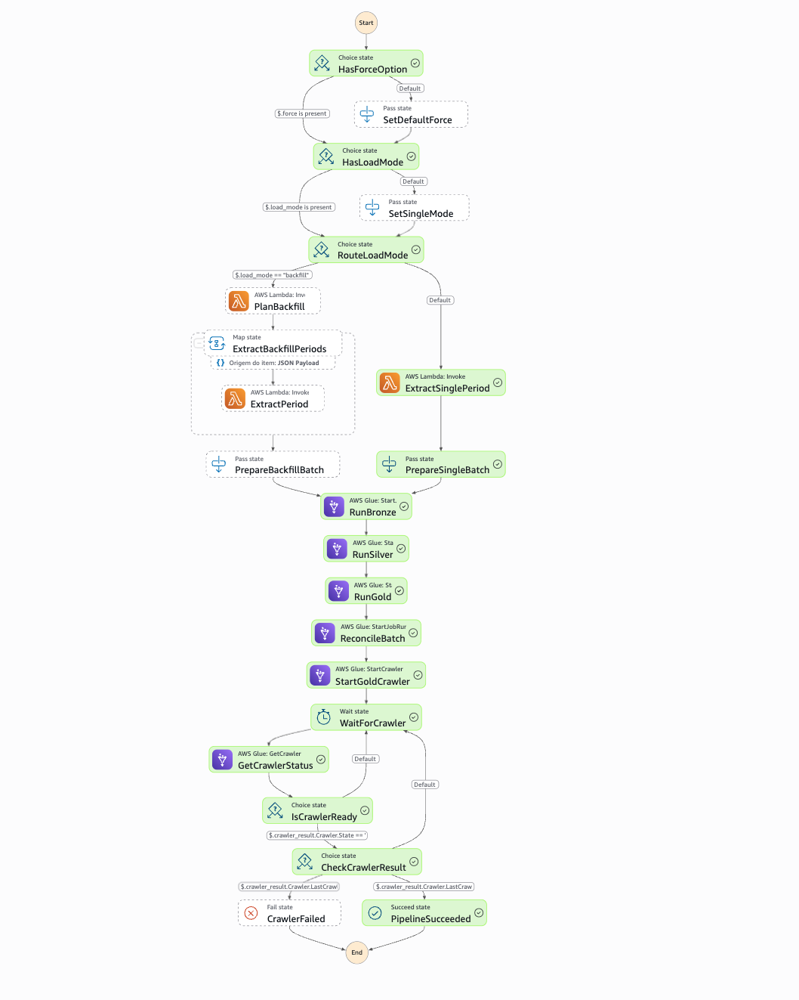
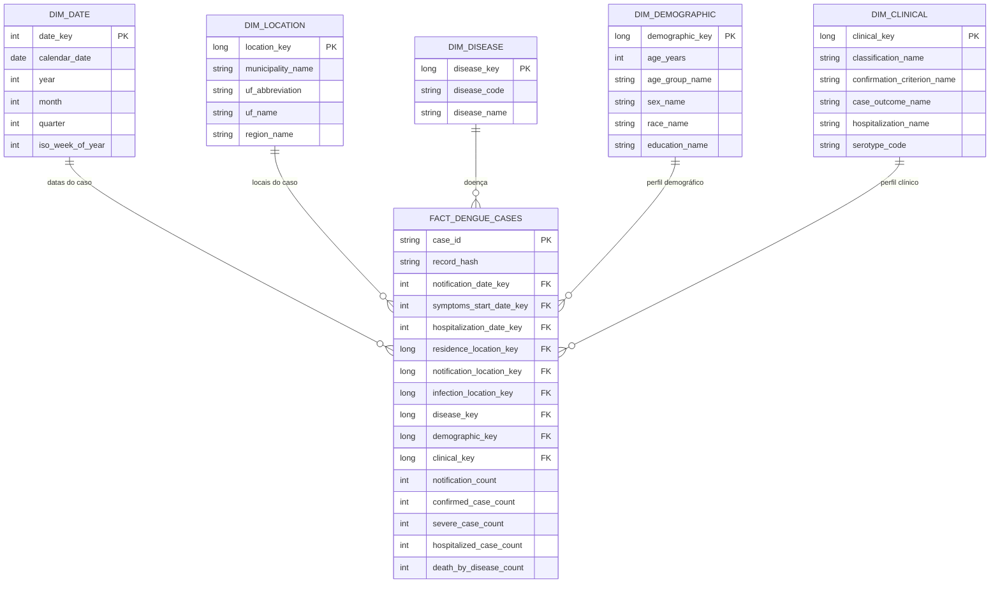
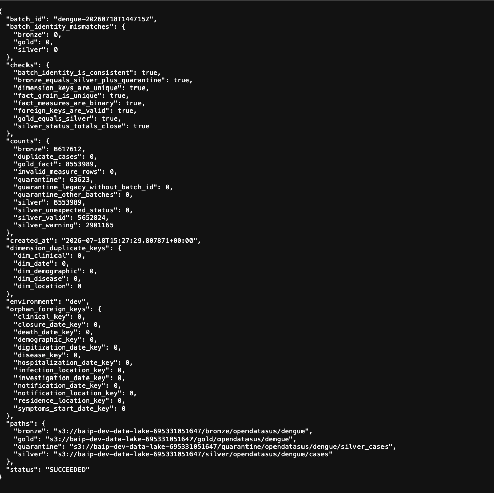
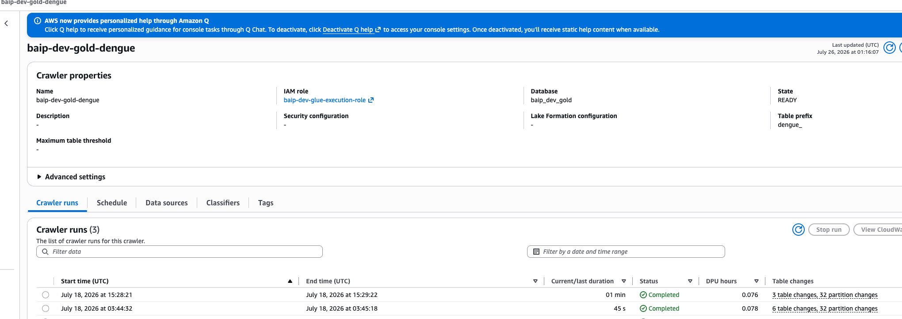
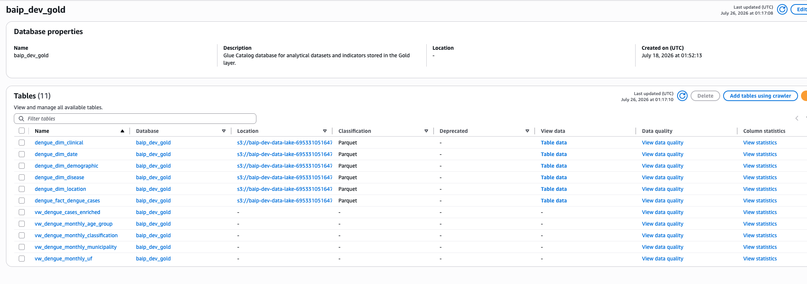
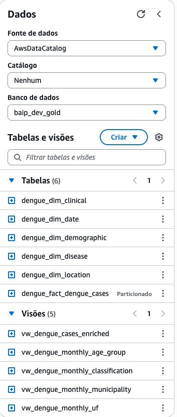
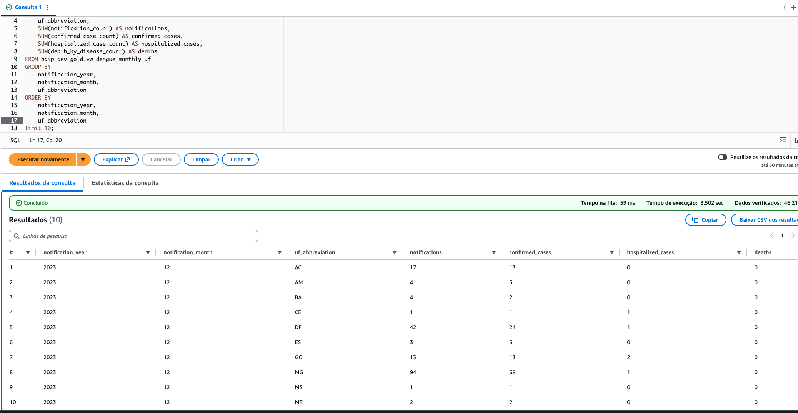
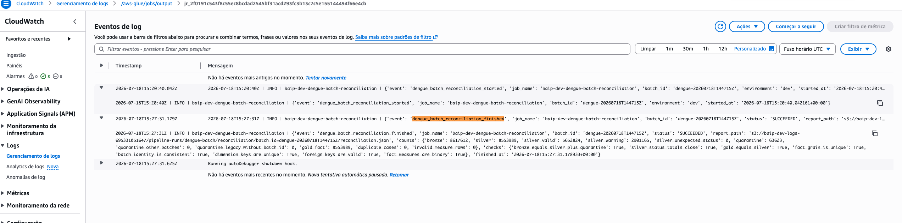
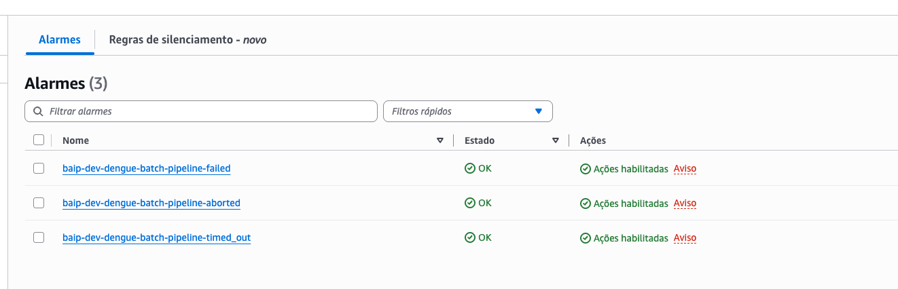

# Fluxo Batch de Dengue

Este documento apresenta o fluxo Batch utilizado para processar dados públicos
de notificações de dengue referentes aos anos de 2024 e 2025 e ao período entre
janeiro e Fevereiro de 2026.

## Diagrama do processo Batch

## 1. Fonte de dados externa

Para representar a fonte externa do fluxo Batch, foi criada uma API local
alimentada com arquivos oficiais de dengue disponibilizados pelo
[DATASUS](https://datasus.saude.gov.br/transferencia-de-arquivos/).

A API utiliza FastAPI e é exposta temporariamente por meio de um túnel HTTPS do
ngrok, permitindo que o processo de extração executado na AWS consulte os dados.

> [!NOTE]
> A implementação da API local é apenas um componente de apoio à demonstração e
> não faz parte do escopo avaliativo da plataforma. O fluxo Batch começa no
> consumo dessa fonte pela AWS.

Cada requisição consulta um único período de notificação. A API aceita períodos
com granularidade mensal ou diária:

| Granularidade | Formatos aceitos             | Exemplos                     |
| ------------- | ---------------------------- | ---------------------------- |
| Mensal        | `YYYY-MM` ou `MM-YYYY`       | `2024-01` ou `01-2024`       |
| Diária        | `YYYY-MM-DD` ou `DD-MM-YYYY` | `2024-01-01` ou `01-01-2024` |

O pipeline oferece dois modos de execução:

* **carga pontual:** processa um único mês ou dia;
* **backfill:** recebe um período inicial e um período final e executa a
  extração de todos os meses ou dias compreendidos no intervalo.

No backfill, a orquestração divide o intervalo em períodos individuais e aciona
a extração de cada período. Dessa forma, a API permanece responsável por
entregar uma única referência por requisição, enquanto o pipeline controla o
processamento completo do intervalo.

## 2. Orquestração e acionamento do pipeline

O fluxo Batch é orquestrado pelo AWS Step Functions e iniciado manualmente por
meio dos comandos de demonstração do projeto.

A execução pode ser acionada em dois modos:

* **pontual:** processa um único mês ou dia;
* **backfill:** processa todos os períodos entre uma referência inicial e final.

A Step Functions identifica o modo solicitado, coordena a extração e executa as
etapas seguintes na ordem correta.

Cada execução recebe um `BATCH_ID`, utilizado para rastrear o mesmo lote entre
as camadas e nos logs.

O fluxo executado é:

1. extração da API para a Staging;
2. transformação de Staging para Bronze;
3. transformação de Bronze para Silver e Quarentena;
4. modelagem da Silver para Gold;
5. reconciliação das camadas;
6. atualização do Glue Data Catalog.

Os jobs são executados de forma síncrona. A Step Functions aguarda o término de
cada etapa e interrompe o pipeline quando ocorre uma falha.

### Diagrama da orquestração

### Evidência da execução

## 2.1 Acionamento do pipeline

No MVP, o pipeline é executado manualmente nos modos pontual ou backfill. Essa decisão evita execuções automáticas e custos desnecessários durante a demonstração.

O Amazon EventBridge poderá ser incorporado futuramente caso seja necessário agendar execuções recorrentes.

## 3. Extração de dados com AWS Lambda

A extração é realizada por uma função AWS Lambda coordenada pelo AWS Step
Functions. A função consulta a API externa e transfere os dados em streaming
para a Staging do Amazon S3 no formato `JSONL.GZ`.

Para cada período, também é criado um manifesto com informações de controle,
como quantidade de registros, tamanho do arquivo, hash SHA-256 e duração da
extração.

Na carga pontual, a Lambda processa apenas o mês ou dia informado.

No backfill, a Step Functions divide o intervalo em períodos e realiza uma
invocação independente da Lambda para cada mês ou dia. As invocações são
executadas sequencialmente para não sobrecarregar a API externa.

Esse modelo evita manter uma única Lambda ativa durante todo o backfill e
permite identificar e reprocessar períodos específicos.

> Cada período representa uma nova invocação lógica. A AWS pode reutilizar o
> ambiente de execução da função.

## 4. Transformação de dados com AWS Glue

A transformação é realizada por três jobs AWS Glue desenvolvidos com PySpark.

| Job                 | Responsabilidade                                                    |
| ------------------- | ------------------------------------------------------------------- |
| Staging para Bronze | Preservar a origem, adicionar rastreabilidade e converter o formato |
| Bronze para Silver  | Padronizar, enriquecer e validar os registros                       |
| Silver para Gold    | Construir o modelo dimensional para consumo analítico               |

### 4.1 Staging para Bronze

O primeiro job lê os arquivos `JSONL.GZ` produzidos pela Lambda. O Spark realiza
a descompressão, valida o schema e preserva as colunas da fonte como texto.

Antes da escrita, o job confere se a quantidade de registros lidos corresponde
ao valor informado nos manifestos de extração.

Os dados são convertidos para Parquet com compressão Snappy e particionados por:

* data de processamento;
* granularidade diária ou mensal;
* período consultado.

Essa organização permite processar cargas pontuais e backfills utilizando a
mesma estrutura.

#### Campos adicionados

| Campo                         | Finalidade                                 |
| ----------------------------- | ------------------------------------------ |
| `_batch_id`                   | Identificar a execução do pipeline         |
| `_source_file`                | Informar o arquivo de origem               |
| `_source_system`              | Identificar o sistema de origem            |
| `_ingestion_source`           | Identificar a API utilizada na ingestão    |
| `_source_format`              | Registrar o formato `jsonl.gz`             |
| `_source_extraction_batch_id` | Relacionar o registro à extração da Lambda |
| `_source_manifest`            | Informar o manifesto da extração           |
| `_bronze_loaded_at`           | Registrar o horário de carga               |
| `_environment`                | Identificar o ambiente                     |
| `processing_date`             | Registrar a data de processamento          |
| `granularity`                 | Identificar a carga como diária ou mensal  |
| `reference_period`            | Registrar o período consultado             |
| `reference_year`              | Identificar o ano de referência            |
| `notification_year`           | Extrair o ano da notificação               |
| `notification_month`          | Extrair o mês da notificação               |
| `disease`                     | Identificar registros de dengue            |

A Bronze não aplica regras de negócio. Sua finalidade é preservar os dados
recebidos, acrescentar rastreabilidade e disponibilizar um formato mais
eficiente para os próximos jobs.

### 4.2 Bronze para Silver

O segundo job transforma os dados brutos em um contrato padronizado para
análise e aplicação das regras de qualidade.

As principais tratativas são:

* conversão de datas, números e indicadores;
* tradução dos códigos do SINAN;
* cálculo da idade e da faixa etária;
* enriquecimento de municípios, UFs e regiões com a referência do IBGE;
* criação de indicadores de confirmação, gravidade, hospitalização e óbito;
* geração de identificadores técnicos;
* identificação de duplicidades;
* classificação dos registros como `valid`, `warning` ou `quarantined`.

#### Principais campos adicionados

| Grupo           | Exemplos                                                        |
| --------------- | --------------------------------------------------------------- |
| Identificação   | `record_id` e `record_hash`                                     |
| Localização     | município, UF e região de residência, notificação e infecção    |
| Demografia      | idade, faixa etária, sexo, gestação, raça e escolaridade        |
| Classificação   | classificação final, critério de confirmação e evolução         |
| Indicadores     | confirmado, descartado, grave, hospitalizado, óbito e autóctone |
| Qualidade       | `data_quality_status` e `quality_warning_codes`                 |
| Rastreabilidade | lote, manifesto, arquivo e datas de carga                       |

Como a fonte não possui um identificador estável para cada notificação, o job
calcula um hash SHA-256 a partir das colunas de negócio. Esse hash é utilizado
na construção do `record_id` e na identificação de registros exatamente iguais.

Registros com alertas não bloqueantes permanecem na Silver com status
`warning`. Alguns exemplos são classificação ausente, hospitalização
desconhecida ou diferença entre o ano do arquivo e o ano da notificação.

> [ADR-011 — Qualidade de Dados](../../architecture/ADR/ADR-011-Qualidade-Dados.md)

#### 4.2.1 Quarentena

Registros que violam regras obrigatórias são separados na Quarentena e não
seguem para a Gold.

| Regra                          | Exemplo simplificado                                  |
| ------------------------------ | ----------------------------------------------------- |
| Doença não reconhecida         | Código da doença diferente de dengue                  |
| Data inválida                  | Data de notificação ausente ou ilegível               |
| Data futura                    | Notificação posterior à data atual                    |
| Município obrigatório ausente  | Município de residência não informado                 |
| Município não encontrado       | Código do município inexistente na referência do IBGE |
| Identidade da origem ausente   | Lote, arquivo ou hash não informado                   |
| Lote divergente                | Registro associado a outro `BATCH_ID`                 |
| Sequência cronológica inválida | Início dos sintomas posterior à notificação           |
| Duplicidade                    | Dois registros com o mesmo `record_id`                |

Cada registro rejeitado recebe:

* `quality_error_codes`, com todos os erros encontrados;
* `primary_error_code`, com o principal motivo da rejeição;
* `quarantined_at`, com o horário da rejeição;
* os metadados necessários para auditoria e reprocessamento.

A Quarentena evita descartar dados silenciosamente e impede que registros
inválidos contaminem as análises.

#### Amostra dos registros em Quarentena

<!--

-->

### 4.3 Silver para Gold

O terceiro job utiliza os registros `valid` e `warning` da Silver para construir
um modelo dimensional.

A Gold é reconstruída como um snapshot completo. Quando um mesmo `record_id`
possui mais de uma versão na Silver, o job mantém a versão mais recente.

O modelo possui cinco dimensões e uma tabela fato:

| Tabela              | Conteúdo                                                     |
| ------------------- | ------------------------------------------------------------ |
| `dim_date`          | Data, ano, mês, trimestre, semana e dia                      |
| `dim_location`      | Município, UF e região                                       |
| `dim_disease`       | Código e nome da doença                                      |
| `dim_demographic`   | Idade, faixa etária, sexo, gestação, raça e escolaridade     |
| `dim_clinical`      | Classificação, critério, evolução, hospitalização e sorotipo |
| `fact_dengue_cases` | Uma linha por caso com chaves, medidas e rastreabilidade     |

A `dim_date` é reutilizada para as datas de notificação, sintomas, investigação,
digitação, internação, encerramento e óbito.

A `dim_location` é reutilizada para os locais de residência, notificação e
provável infecção.

#### Modelo estrela

A tabela fato utiliza uma linha por `case_id` e armazena medidas binárias para
notificações, confirmações, descartes, casos graves, hospitalizações, óbitos e
outros indicadores.

Ela é particionada pelo ano e mês da notificação para reduzir o volume de dados
lido nas consultas do Athena.

> [ADR-009 — Modelagem de Data Warehouse](../../architecture/ADR/ADR-009-Modelagem-Data-Warehouse.md)

## 5. Reconciliação do lote

A reconciliação é executada após a criação da Gold. Seu objetivo é confirmar
que o pipeline produziu dados completos e consistentes antes da atualização do
catálogo.

Um job pode terminar sem erro técnico e ainda produzir registros ausentes,
duplicados ou com relacionamentos inválidos. Por isso, a reconciliação funciona
como uma etapa final de Data Quality.

### 5.1 Verificações realizadas

| Verificação             | Resultado esperado                                 |
| ----------------------- | -------------------------------------------------- |
| Fechamento do lote      | Bronze = Silver + Quarentena                       |
| Status da Silver        | Silver = registros válidos + registros com aviso   |
| Publicação na Gold      | Registros atuais da Silver presentes na Gold       |
| Snapshot da Gold        | Gold corresponde à versão mais recente da Silver   |
| Hash dos registros      | Silver e Gold possuem o mesmo conteúdo             |
| Granularidade da fato   | Um único registro por `case_id`                    |
| Chaves dimensionais     | Ausência de chaves duplicadas                      |
| Integridade referencial | Todas as chaves da fato existem nas dimensões      |
| Medidas                 | Indicadores de contagem possuem somente `0` ou `1` |
| Identidade do lote      | Registros pertencem ao `BATCH_ID` processado       |

O resultado é gravado em um relatório `reconciliation.json`, contendo os
volumes, as divergências encontradas e o resultado de cada verificação.

Se alguma regra falhar, o relatório recebe o status `FAILED` e a Step Functions
interrompe a publicação do pipeline.

### Evidências da reconciliação

## 6. Glue Crawler e Data Catalog

Após a aprovação da reconciliação, a Step Functions inicia o Glue Crawler da
camada Gold e aguarda sua conclusão.

O Crawler identifica as tabelas e partições armazenadas no Amazon S3 e atualiza
o banco `baip_dev_gold` no AWS Glue Data Catalog.

O catálogo disponibiliza as dimensões e a tabela fato para consulta no Athena:

* `dengue_dim_date`;
* `dengue_dim_location`;
* `dengue_dim_disease`;
* `dengue_dim_demographic`;
* `dengue_dim_clinical`;
* `dengue_fact_dengue_cases`.

O Data Catalog armazena somente os metadados. Os arquivos permanecem na camada
Gold do Amazon S3.

### Evidências do catálogo

> [ADR-010 — Catálogo de Dados com AWS Glue Data Catalog](../../architecture/ADR/ADR-010-Catalogo-Dados-Glue.md)

## 7. Consumo analítico com Amazon Athena

O Amazon Athena consulta os arquivos Parquet da Gold utilizando as tabelas
registradas no Glue Data Catalog.

As consultas são executadas em um workgroup próprio, com controle do local dos
resultados, publicação de métricas e limite de dados processados.

Para simplificar o consumo, foram criadas views analíticas sobre o modelo
dimensional:

| View                               | Finalidade                                   |
| ---------------------------------- | -------------------------------------------- |
| `vw_dengue_cases_enriched`         | Apresenta os casos relacionados às dimensões |
| `vw_dengue_monthly_municipality`   | Indicadores mensais por município            |
| `vw_dengue_monthly_uf`             | Indicadores mensais por UF                   |
| `vw_dengue_monthly_age_group`      | Indicadores mensais por faixa etária         |
| `vw_dengue_monthly_classification` | Indicadores mensais por classificação        |

As views disponibilizam notificações, confirmações, hospitalizações, casos
graves, óbitos e outros indicadores sem exigir que o consumidor conheça os
relacionamentos internos do modelo dimensional.

### Evidências do consumo analítico

> [ADR-014 — Consumo Analítico com Amazon Athena](../../architecture/ADR/ADR-014-Consumo-Analitico-PowerBI-Athena.md)

## 8. Observabilidade com Amazon CloudWatch

O Amazon CloudWatch centraliza os logs e as métricas da Lambda, dos jobs Glue,
da Step Functions e do Athena.

Os registros incluem:

* início e término das execuções;
* duração das etapas;
* quantidade de registros processados;
* caminhos de entrada e saída;
* erros e motivos de falha;
* `BATCH_ID` utilizado na rastreabilidade do lote.

A Step Functions envia seus logs para um grupo com retenção de 30 dias. O
conteúdo completo das entradas e saídas não é armazenado, reduzindo exposição e
custo de armazenamento.

O projeto também possui alarmes para execuções da Step Functions que terminam
com falha, timeout ou interrupção. Quando acionados, os alarmes publicam uma
notificação no tópico SNS do fluxo Batch.

A observabilidade técnica é complementada pelo relatório de reconciliação:

| Componente    | Responsabilidade                                                 |
| ------------- | ---------------------------------------------------------------- |
| CloudWatch    | Monitorar execução, duração, logs e falhas técnicas              |
| Reconciliação | Validar volumetria, duplicidade, chaves e consistência dos dados |

### Evidências da observabilidade

### cloudwatch

### SNS

> [ADR-012 — Observabilidade e Monitoramento](../../architecture/ADR/ADR-012-Observabilidade-Monitoramento.md)
