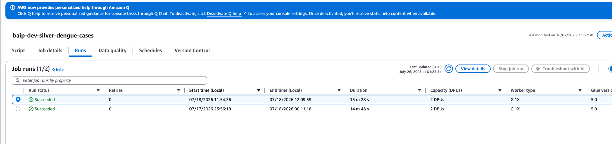
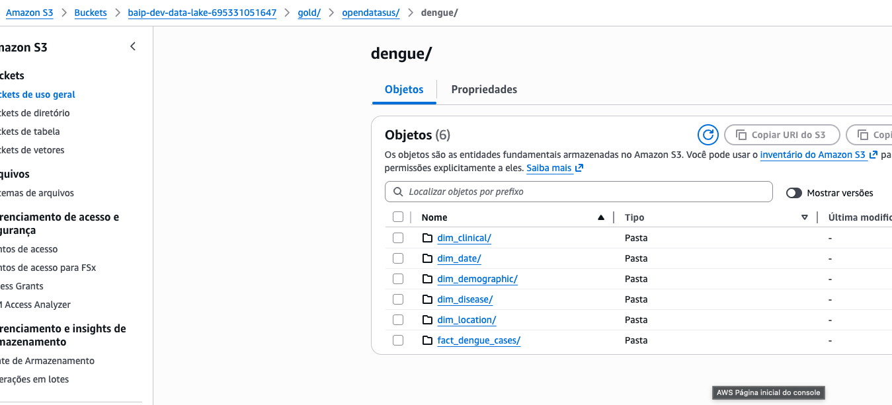
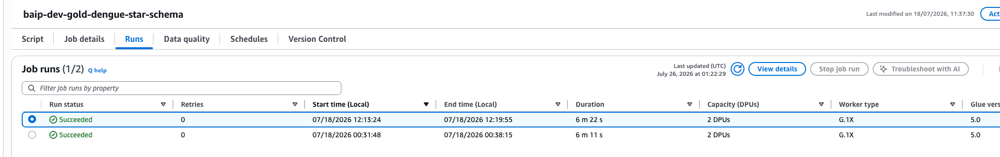
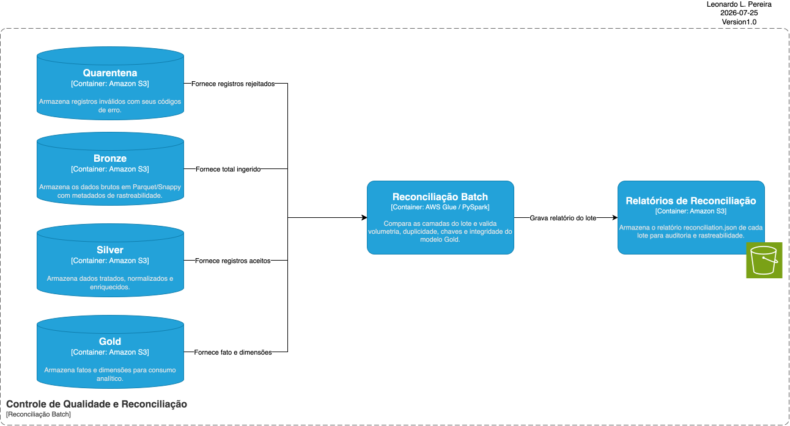
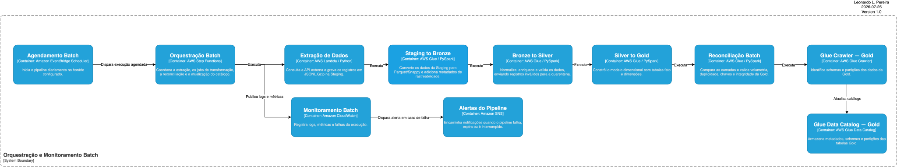

# Fluxo Batch de Dengue

Este documento apresenta o fluxo Batch utilizado para processar dados públicos
de notificações de dengue dos anos de 2024, 2025 e do período entre janeiro e
julho de 2026.

## Diagrama do processo Batch


## 1. Fonte de dados externa

A fonte externa será uma API executada localmente e exposta temporariamente por
meio de um túnel HTTPS criado com o ngrok. A API será alimentada com arquivos
públicos de dengue disponibilizados pelo Ministério da Saúde no formato
`.csv.gz`.

- [Arquivos do DATASUS](https://datasus.saude.gov.br/transferencia-de-arquivos/)

> A implementação interna da API não faz parte do escopo deste projeto. Ela será
> utilizada apenas para representar uma fonte externa controlada.

A API oficial do governo não foi utilizada porque apresentou problemas de
paginação durante os testes, comprometendo a extração completa e determinística
dos dados.


## 2. Extração de dados com AWS Lambda

A extração será executada por uma função AWS Lambda. A função consumirá a API,
converterá o resultado para JSONL, aplicará compressão Gzip e gravará os dados
na área Staging do Amazon S3.

A Lambda receberá a URL temporária do ngrok e o período que deverá ser
consultado. A granularidade será definida pelo formato do período:

| Formato | Granularidade | Exemplo |
|---|---|---|
| `YYYY-MM` | Mensal | `2024-01` |
| `YYYY-MM-DD` | Diária | `2024-01-01` |

Na carga histórica, serão realizadas extrações mensais entre janeiro de 2024 e
julho de 2026. A granularidade diária poderá ser utilizada nas novas cargas ou
no reprocessamento de datas específicas.

A Lambda organizará os arquivos de acordo com a data de processamento, a
granularidade e o período consultado.

Extração mensal:

```text
staging/opendatasus/dengue/
└── processing_date=YYYY-MM-DD/
    └── granularity=month/
        └── reference_period=YYYY-MM/
            └── dengue.jsonl.gz
```

Extração diária:

```text
staging/opendatasus/dengue/
└── processing_date=YYYY-MM-DD/
    └── granularity=day/
        └── reference_period=YYYY-MM-DD/
            └── dengue.jsonl.gz
```

Essa organização permite identificar quando o arquivo foi processado, qual
granularidade foi utilizada e qual período de notificação foi consultado.

> [ADR-0XX — Extração Batch com AWS Lambda](../../architecture/ADR/ADR-024-Extracao-Batch-Lambda.md)


## 3. Transformação de dados com AWS Glue

O AWS Glue será utilizado para processar os dados entre as camadas Staging,
Bronze, Silver e Gold.

Cada job possui uma responsabilidade específica, permitindo separar a
preservação dos dados, as regras de qualidade e a modelagem analítica.

> [ADR-003 — Processamento Batch com AWS Glue](../../architecture/ADR/ADR-003-Processamento-Batch-Glue.md)

### 3.1 Staging para Bronze

O primeiro job Glue lerá o arquivo `.jsonl.gz` produzido pela Lambda, adicionará
metadados de rastreabilidade e gravará os dados na Bronze em formato
Parquet/Snappy.

Nesta etapa não serão aplicadas regras de negócio. Os dados de origem serão
preservados para permitir auditoria e reprocessamento.

O processo realizará:

1. leitura do arquivo JSONL compactado;
2. validação do schema de entrada;
3. normalização dos nomes das colunas;
4. inclusão dos metadados técnicos;
5. conversão para Parquet/Snappy;
6. gravação na Bronze seguindo o período recebido da Lambda.

#### Metadados adicionados

| Campo | Descrição |
|---|---|
| `_batch_id` | Identificador da execução do pipeline |
| `_source_file` | Arquivo de origem na Staging |
| `_source_system` | Sistema que forneceu os dados |
| `_source_format` | Formato recebido na Staging |
| `_bronze_loaded_at` | Data e horário da carga na Bronze |
| `_environment` | Ambiente de execução |
| `processing_date` | Data em que a extração foi processada |
| `granularity` | Granularidade mensal ou diária |
| `reference_period` | Período de notificação consultado na API |

#### Parâmetros do job

| Parâmetro | Descrição |
|---|---|
| `--STAGING_INPUT_PATH` | Caminho exato gravado pela Lambda |
| `--BRONZE_OUTPUT_PATH` | Caminho base da camada Bronze |
| `--BATCH_ID` | Identificador do lote |
| `--PROCESSING_DATE` | Data de processamento |
| `--GRANULARITY` | Granularidade `month` ou `day` |
| `--REFERENCE_PERIOD` | Período mensal ou diário consultado |

A Lambda retornará o `STAGING_INPUT_PATH` após concluir a escrita. Esse valor
será repassado ao Glue pela orquestração, evitando que o job precise descobrir
qual arquivo deve processar.

#### Leitura mensal

```text
s3://<data-lake-bucket>/staging/opendatasus/dengue/
└── processing_date=YYYY-MM-DD/
    └── granularity=month/
        └── reference_period=YYYY-MM/
            └── dengue.jsonl.gz
```

#### Escrita mensal

```text
s3://<data-lake-bucket>/bronze/opendatasus/dengue/
└── processing_date=YYYY-MM-DD/
    └── granularity=month/
        └── reference_period=YYYY-MM/
            └── *.snappy.parquet
```

Para cargas diárias, `granularity` será `day` e `reference_period` utilizará o
formato `YYYY-MM-DD`.

#### Evidência — Data Lake

<!--
Adicionar captura dos paths da Staging e da Bronze no Amazon S3.


-->

#### Evidência — Glue Job

<!--
Adicionar captura da execução concluída do Glue Job.


-->

#### Amostra dos dados

<!--
Adicionar uma amostra dos dados gravados na Bronze, sem informações sensíveis.
-->

### 3.2 Bronze para Silver

O job Bronze to Silver será responsável pela padronização, validação e
enriquecimento dos dados.

O processo realizará:

1. leitura dos dados em Parquet da Bronze;
2. padronização de valores nulos;
3. conversão de datas, números, códigos e indicadores;
4. tradução dos códigos de domínio;
5. cálculo da idade e da faixa etária;
6. enriquecimento dos municípios com a referência do IBGE;
7. criação de identificadores técnicos;
8. identificação de registros duplicados;
9. aplicação das regras de qualidade;
10. separação entre Silver e quarentena.

A referência do IBGE será utilizada para resolver os nomes dos municípios, UFs
e regiões de residência, notificação e provável infecção.

#### Principais campos tratados

| Grupo | Campos |
|---|---|
| Identificação | `record_id`, `record_hash`, `source_batch_id` |
| Datas | notificação, sintomas, investigação, internação, óbito e encerramento |
| Localização | município, UF e região |
| Demografia | idade, faixa etária, sexo, gestação, raça e escolaridade |
| Classificação | classificação final, critério de confirmação e evolução |
| Indicadores | confirmado, descartado, grave, hospitalizado, óbito e autóctone |
| Qualidade | `data_quality_status` e `quality_warning_codes` |
| Rastreabilidade | arquivo de origem e datas de carga |

Os registros sem erros bloqueantes serão gravados na Silver. Registros com
alertas não bloqueantes permanecerão disponíveis com o status `warning`.

#### Parâmetros do job

| Parâmetro | Descrição |
|---|---|
| `--BATCH_ID` | Identificador do lote |
| `--BRONZE_INPUT_PATH` | Caminho dos dados na Bronze |
| `--IBGE_REFERENCE_PATH` | Caminho da referência de municípios |
| `--SILVER_OUTPUT_PATH` | Caminho de saída da Silver |
| `--QUARANTINE_OUTPUT_PATH` | Caminho de saída da quarentena |
| `--WRITE_MODE` | Modo de escrita |

#### Leitura da Bronze

```text
s3://<data-lake-bucket>/bronze/opendatasus/dengue/
└── processing_date=YYYY-MM-DD/
    └── granularity=<month|day>/
        └── reference_period=<YYYY-MM|YYYY-MM-DD>/
```

#### Escrita na Silver

```text
s3://<data-lake-bucket>/silver/opendatasus/dengue/cases/
└── disease_name=dengue/
    └── notification_year=YYYY/
        └── notification_month=MM/
            └── *.snappy.parquet
```

A Bronze mantém a organização operacional da extração. A Silver utiliza a data
de notificação porque essa é a principal referência para consultas e
reprocessamentos de negócio.

> [ADR-011 — Qualidade de Dados](../../architecture/ADR/ADR-011-Qualidade-Dados.md)

#### Evidência — Silver no Data Lake

<!--
Adicionar captura dos arquivos e partições da Silver no Amazon S3.


-->

#### Evidência — Glue Job

<!--
Adicionar captura da execução concluída do Glue Bronze to Silver.


-->

#### Amostra dos dados Silver

<!--
Adicionar uma amostra de registros com status valid e warning.
-->

#### 3.2.1 Bronze para quarentena

Os registros que violarem regras bloqueantes serão enviados para a quarentena,
sem interromper o processamento dos registros válidos.

Entre os motivos de quarentena estão:

- doença não reconhecida;
- data de notificação inválida, futura ou incompatível;
- município de residência ausente ou não encontrado;
- identidade da fonte ou do lote ausente;
- divergência entre o lote recebido e o lote processado;
- sequência cronológica inválida;
- registro duplicado.

Cada registro rejeitado manterá os dados necessários para investigação e
reprocessamento.

#### Campos de controle da quarentena

| Campo | Descrição |
|---|---|
| `quality_error_codes` | Lista de erros encontrados |
| `primary_error_code` | Principal motivo da rejeição |
| `source_batch_id` | Lote de origem |
| `source_file` | Arquivo de origem |
| `quarantined_at` | Data e horário da rejeição |
| `quarantine_year` | Ano da rejeição |
| `quarantine_month` | Mês da rejeição |

#### Escrita na quarentena

```text
s3://<data-lake-bucket>/quarantine/opendatasus/dengue/silver_cases/
└── primary_error_code=<ERROR_CODE>/
    └── quarantine_year=YYYY/
        └── quarantine_month=MM/
            └── *.snappy.parquet
```

A quarentena permite investigar problemas sem descartar os registros e sem
contaminar a camada analítica.

#### Evidência — Quarentena no Data Lake

<!--
Adicionar captura das partições da quarentena organizadas por código de erro.


-->

#### Amostra dos dados em quarentena

<!--
Adicionar uma amostra com quality_error_codes e primary_error_code.
-->

### 3.3 Silver para Gold

O job Silver to Gold construirá o modelo dimensional utilizado para consultas
analíticas.

Somente registros Silver com status `valid` ou `warning` serão processados.
Registros enviados para a quarentena não entrarão na Gold.

Antes da escrita, o job validará:

- presença das colunas obrigatórias;
- correspondência do `batch_id`;
- existência de registros;
- unicidade do `record_id`.

#### Modelo dimensional

| Tabela | Responsabilidade |
|---|---|
| `dim_date` | Datas utilizadas nos diferentes eventos do caso |
| `dim_location` | Municípios, UFs e regiões |
| `dim_disease` | Código e nome da doença |
| `dim_demographic` | Idade, faixa etária, sexo, gestação, raça e escolaridade |
| `dim_clinical` | Classificação, critério, evolução, hospitalização e sorotipo |
| `fact_dengue_cases` | Medidas e chaves relacionadas a cada caso |

A tabela fato terá uma linha por `record_id` e armazenará medidas binárias para
facilitar as agregações:

- notificações;
- casos confirmados;
- casos descartados;
- casos com sinais de alarme;
- casos graves;
- casos em investigação;
- hospitalizações;
- óbitos;
- casos autóctones;
- registros com alerta de qualidade.

#### Parâmetros do job

| Parâmetro | Descrição |
|---|---|
| `--BATCH_ID` | Identificador do lote |
| `--SILVER_INPUT_PATH` | Caminho de leitura da Silver |
| `--GOLD_OUTPUT_PATH` | Caminho base da Gold |
| `--WRITE_MODE` | Modo de escrita |

#### Leitura da Silver

```text
s3://<data-lake-bucket>/silver/opendatasus/dengue/cases/
```

#### Escrita das dimensões

```text
s3://<data-lake-bucket>/gold/opendatasus/dengue/
├── dim_date/
├── dim_location/
├── dim_disease/
├── dim_demographic/
└── dim_clinical/
```

#### Escrita da tabela fato

```text
s3://<data-lake-bucket>/gold/opendatasus/dengue/
└── fact_dengue_cases/
    └── notification_year=YYYY/
        └── notification_month=MM/
            └── *.snappy.parquet
```

O particionamento mensal da fato reduz a quantidade de dados lidos nas consultas
por período no Athena.

> [ADR-009 — Modelagem de Data Warehouse](../../architecture/ADR/ADR-009-Modelagem-Data-Warehouse.md)

#### Evidência — Gold no Data Lake

<!--
Adicionar captura das dimensões e da tabela fato no Amazon S3.


-->

#### Evidência — Glue Job

<!--
Adicionar captura da execução concluída do Glue Silver to Gold.


-->

#### Amostra do modelo dimensional

<!--
Adicionar uma amostra da tabela fato e das principais dimensões.
-->

## 4. Job de reconciliação

O job de reconciliação é executado após o processamento das camadas Bronze,
Silver e Gold. Sua responsabilidade é verificar se o lote terminou de forma
consistente antes de disponibilizar os dados para consulta.



### 4.1 Motivo do job

Um job pode terminar tecnicamente com sucesso, mas ainda produzir dados
incompletos ou inconsistentes.

Por exemplo, a Gold pode conter menos registros que a Silver ou a tabela fato
pode possuir chaves duplicadas.

A reconciliação adiciona uma validação final ao pipeline. Ela compara as camadas
e verifica se as regras estruturais do modelo analítico foram atendidas.

### 4.2 Funcionamento

O job recebe o `batch_id` da execução e realiza as seguintes verificações:

| Verificação | Regra esperada |
|---|---|
| Identidade do lote | Bronze, Silver e Gold devem pertencer ao mesmo `batch_id` |
| Fechamento da Silver | Bronze deve ser igual a Silver mais Quarentena |
| Status da Silver | Silver deve ser igual a registros válidos mais registros com aviso |
| Fechamento da Gold | Quantidade da tabela fato deve ser igual à quantidade da Silver |
| Granularidade da fato | Cada `record_id` deve aparecer uma única vez |
| Chaves das dimensões | As chaves das dimensões não podem estar duplicadas |
| Integridade referencial | As chaves da fato devem existir nas dimensões |
| Medidas da fato | Indicadores de contagem devem conter somente `0` ou `1` |

Ao final, o job gera um relatório JSON contendo:

- identificação do lote;
- quantidade de registros por camada;
- quantidade de registros em quarentena;
- resultado de cada verificação;
- inconsistências de chaves;
- caminhos verificados;
- status final da reconciliação.

O relatório é armazenado no seguinte caminho:

```text
s3://<logs-bucket>/
└── pipeline-runs/
    └── dengue-batch/
        └── reconciliation/
            └── batch_id=<BATCH_ID>/
                └── reconciliation.json
```

Quando todas as verificações são aprovadas:

```text
status = SUCCEEDED
```

Quando alguma verificação falha:

```text
status = FAILED
```

Se o parâmetro `FAIL_ON_MISMATCH` estiver habilitado, uma divergência também
causa a falha do job e interrompe o pipeline.

> **Evidência a adicionar:** execução do job de reconciliação.

<!--

-->

> **Evidência a adicionar:** relatório de reconciliação no Amazon S3.

<!--

-->

## 5. Orquestração e acionamento do pipeline

A execução do fluxo Batch é coordenada pelo AWS Step Functions. Esse serviço
controla a ordem das etapas, aguarda a conclusão de cada processamento e
interrompe o pipeline quando ocorre uma falha.



### 5.1 Funcionamento

Cada execução recebe um identificador único. Esse valor é enviado aos jobs como
`BATCH_ID` e permite rastrear o mesmo lote entre as diferentes camadas.

O fluxo seguirá esta ordem:

1. extrair os dados da API com AWS Lambda;
2. executar o job Staging para Bronze;
3. executar o job Bronze para Silver;
4. executar o job Silver para Gold;
5. executar o job de reconciliação;
6. iniciar o Glue Crawler da Gold;
7. aguardar a atualização do Glue Data Catalog;
8. finalizar o pipeline com sucesso.

Os jobs do AWS Glue são chamados de forma síncrona. A Step Functions aguarda o
término de uma etapa antes de iniciar a próxima.

Se um job falhar, as etapas seguintes não são executadas. As falhas são
registradas no Amazon CloudWatch e podem gerar notificações pelo Amazon SNS.

### 5.2 Formas de acionamento

O pipeline poderá ser acionado de duas formas.

#### Carga histórica

A carga histórica será iniciada manualmente, informando:

- URL temporária da API publicada pelo ngrok;
- período que deverá ser extraído;
- granularidade mensal ou diária.

Exemplo:

```json
{
  "api_url": "https://exemplo.ngrok-free.app",
  "reference_period": "2024-01",
  "granularity": "month"
}
```

Esse formato permite executar ou reprocessar períodos específicos.

#### Execução agendada

O Amazon EventBridge poderá iniciar a Step Functions em um horário definido,
permitindo a execução recorrente do pipeline.

Entretanto, o agendamento automático depende de um endereço acessível para a
API. Como a URL gratuita do ngrok pode mudar, ela deverá ser atualizada antes da
execução ou armazenada em uma configuração consultada pela Lambda.

Durante o desenvolvimento, o acionamento poderá permanecer manual. Em uma
evolução da solução, a API poderá utilizar um endereço estável, permitindo a
execução automática pelo EventBridge.

> **Evidência a adicionar:** execução completa no AWS Step Functions.

<!--

-->

> **Evidência a adicionar:** alerta ou logs da execução no Amazon CloudWatch.

<!--

-->

> [ADR-0XX — Orquestração do fluxo Batch com AWS Step Functions](../../architecture/ADR/ADR-0XX-Orquestracao-Batch-Step-Functions.md)

## 6. Glue Crawler e Data Catalog

Após a aprovação do job de reconciliação, a Step Functions inicia o Glue
Crawler da camada Gold.

O Crawler examina os diretórios da Gold no Amazon S3, identifica os schemas e
as partições e atualiza as tabelas técnicas no AWS Glue Data Catalog.

O fluxo dessa etapa é:

```text
Gold no Amazon S3
        ↓
AWS Glue Crawler
        ↓
AWS Glue Data Catalog
        ↓
Amazon Athena
```

O Crawler utiliza como origem:

```text
s3://<data-lake-bucket>/gold/opendatasus/dengue/
```

As tabelas são registradas no banco:

```text
baip_dev_gold
```

O prefixo `dengue_` é adicionado aos nomes identificados pelo Crawler. Como
resultado, o catálogo disponibiliza as seguintes tabelas:

- `dengue_dim_date`;
- `dengue_dim_location`;
- `dengue_dim_disease`;
- `dengue_dim_demographic`;
- `dengue_dim_clinical`;
- `dengue_fact_dengue_cases`.

O Data Catalog não movimenta nem copia os arquivos. Ele armazena metadados como:

- nome da tabela;
- nomes e tipos das colunas;
- formato dos arquivos;
- localização no Amazon S3;
- estrutura de partições.

Esses metadados permitem que o Athena interprete os arquivos Parquet da Gold
como tabelas consultáveis por SQL.

Durante a atualização do catálogo, o Crawler:

- adiciona ou atualiza partições;
- incorpora novas colunas identificadas;
- atualiza schemas existentes;
- remove do catálogo tabelas que deixaram de existir na origem.

Após iniciar o Crawler, a Step Functions consulta seu estado periodicamente. O
pipeline somente termina com sucesso quando a última execução do Crawler possui
o status `SUCCEEDED`.

> O Crawler realiza descoberta de metadados. Ele não substitui as validações de
> qualidade nem o job de reconciliação.

> **Evidência a adicionar:** execução concluída do Glue Crawler.

<!--

-->

> **Evidência a adicionar:** tabelas da Gold registradas no Glue Data Catalog.

<!--

-->

> [ADR-010 — Catálogo de Dados com AWS Glue Data Catalog](../../architecture/ADR/ADR-010-Catalogo-Dados-Glue.md)

## 7. Consumo analítico com Amazon Athena

O Amazon Athena é utilizado para consultar os dados da Gold diretamente no
Amazon S3 por meio de comandos SQL.

O Athena utiliza os schemas e as partições registrados no Glue Data Catalog.
Por ser um serviço serverless, não é necessário provisionar ou administrar um
banco de dados dedicado para realizar as consultas.

Os resultados das consultas são armazenados em:

```text
s3://<athena-results-bucket>/query-results/
```

As consultas são executadas por um workgroup próprio do projeto. O workgroup
centraliza a configuração dos resultados, publica métricas no CloudWatch e
limita a quantidade de dados que uma consulta pode examinar.

### 7.1 Views analíticas

As views criam contratos de consumo sobre as tabelas fato e dimensões. Elas
escondem a complexidade dos relacionamentos da modelagem dimensional e
disponibilizam estruturas mais simples para analistas e ferramentas de BI.

Uma view não copia os dados da Gold. Ela armazena uma consulta SQL e apresenta
os resultados atuais das tabelas utilizadas.

As seguintes views fazem parte do fluxo:

| View | Finalidade |
|---|---|
| `vw_dengue_cases_enriched` | Relaciona a fato com as dimensões e apresenta os casos enriquecidos |
| `vw_dengue_monthly_municipality` | Consolida indicadores mensais por município |
| `vw_dengue_monthly_uf` | Consolida indicadores mensais por UF |
| `vw_dengue_monthly_age_group` | Consolida indicadores mensais por faixa etária |
| `vw_dengue_monthly_classification` | Consolida indicadores mensais por classificação e critério |

Os arquivos SQL utilizados para criar as views estão em:

```text
src/athena/dengue/views/
```

A view enriquecida é a base das demais views analíticas. Ela relaciona a tabela
fato às dimensões de data, localização, doença, demografia e informações
clínicas.

As views agregadas disponibilizam indicadores como:

- notificações;
- casos confirmados;
- casos descartados;
- casos com sinais de alarme;
- casos graves;
- casos em investigação;
- hospitalizações;
- óbitos;
- casos autóctones;
- registros com avisos de qualidade.

Exemplo de consulta:

```sql
SELECT
    notification_year,
    notification_month,
    uf_abbreviation,
    SUM(notification_count) AS notifications,
    SUM(confirmed_case_count) AS confirmed_cases,
    SUM(hospitalized_case_count) AS hospitalized_cases,
    SUM(death_by_disease_count) AS deaths
FROM baip_dev_gold.vw_dengue_monthly_uf
GROUP BY
    notification_year,
    notification_month,
    uf_abbreviation
ORDER BY
    notification_year,
    notification_month,
    uf_abbreviation;
```

> **Evidência a adicionar:** views criadas no banco `baip_dev_gold`.


> **Evidência a adicionar:** resultado de uma consulta analítica.


> [ADR-014 — Consumo Analítico com Amazon Athena](../../architecture/ADR/ADR-014-Consumo-Analitico-PowerBI-Athena.md)

## 8. Observabilidade com Amazon CloudWatch

O Amazon CloudWatch concentra os logs, as métricas e os alarmes operacionais do
fluxo Batch.

A observabilidade permite responder perguntas como:

- qual etapa está em execução;
- quanto tempo cada job levou;
- quantos registros foram processados;
- por que uma execução falhou;
- qual `batch_id` apresentou o problema;
- se a Step Functions falhou, expirou ou foi interrompida.

### 8.1 Logs dos jobs

Os jobs do AWS Glue possuem métricas e logs contínuos habilitados. Cada job
registra eventos de início, término, quantidade de registros e caminhos de
entrada e saída.

O `batch_id` é incluído nos logs para relacionar os eventos da Bronze, Silver,
Gold e reconciliação à mesma execução.

Os logs também registram métricas de dados, como:

- registros recebidos;
- registros aceitos na Silver;
- registros com avisos;
- registros enviados para a Quarentena;
- registros escritos na Gold;
- resultado das verificações de reconciliação.

### 8.2 Logs da orquestração

A Step Functions envia os erros da execução para um grupo de logs específico:

```text
/aws/vendedlogs/states/baip-dev-dengue-batch-pipeline
```

Os logs possuem retenção configurada de 30 dias. O conteúdo completo dos dados
de entrada e saída não é registrado, reduzindo exposição desnecessária de
informações e volume de armazenamento.

### 8.3 Métricas e alarmes

O projeto possui alarmes para os seguintes estados terminais da Step Functions:

| Métrica | Situação monitorada |
|---|---|
| `ExecutionsFailed` | Execução finalizada com falha |
| `ExecutionsTimedOut` | Execução excedeu o tempo máximo |
| `ExecutionsAborted` | Execução foi interrompida |

Quando uma dessas métricas registra pelo menos uma ocorrência, o CloudWatch
aciona o tópico SNS:

```text
baip-dev-dengue-batch-alerts
```

O tópico representa o canal de notificação do pipeline. Para que uma pessoa ou
sistema receba o alerta, deve ser cadastrada uma assinatura no SNS, como e-mail
ou outro destino autorizado.

O workgroup do Athena também publica métricas no CloudWatch, permitindo
acompanhar as execuções e o volume de dados processado pelas consultas.

### 8.4 Observabilidade técnica e de dados

O CloudWatch acompanha a saúde técnica da execução. O relatório de
reconciliação complementa esse monitoramento verificando a consistência dos
dados.

```text
CloudWatch
└── execução, duração, logs, falhas e alarmes

Reconciliação
└── volumetria, duplicidade, chaves e consistência entre camadas
```

Essa combinação evita considerar o pipeline saudável apenas porque os serviços
terminaram sem erro técnico.

> **Evidência a adicionar:** logs estruturados de um job do AWS Glue.


> **Evidência a adicionar:** métricas e alarmes da Step Functions.

<!--

-->

> [ADR-012 — Observabilidade e Monitoramento](../../architecture/ADR/ADR-012-Observabilidade-Monitoramento.md)