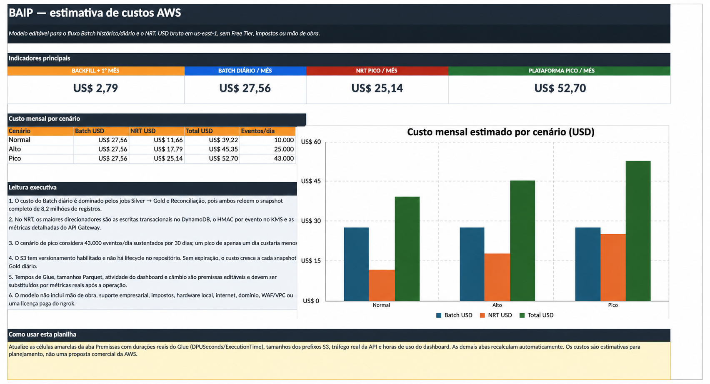

# Estimativa de custos da BAIP

Esta estimativa apresenta o custo mensal da arquitetura atualmente implementada
na **BAIP — Brazil Arbovirus Intelligence Platform**, separando os fluxos
**Batch** e **Near Real-Time (NRT)**.

> [!IMPORTANT]
> No cenário normal, o custo esperado da plataforma é de **US$ 39,22 por mês**:
> **US$ 27,56** do Batch diário e **US$ 11,66** do NRT com 10 mil eventos por dia.

## Visão executiva

| Cenário | Eventos NRT por dia | Batch mensal | NRT mensal | Plataforma mensal |
|---|---:|---:|---:|---:|
| **Normal** | 10.000 | US$ 27,56 | US$ 11,66 | **US$ 39,22** |
| **Alto** | 25.000 | US$ 27,56 | US$ 17,79 | **US$ 45,35** |
| **Pico** | 43.000 | US$ 27,56 | US$ 25,14 | **US$ 52,70** |

O cenário de pico considera **43 mil eventos diários durante 30 dias**. Esse
volume foi inspirado no pico de 43.134 novos casos prováveis registrado em 24
horas em abril de 2024. O volume real varia conforme a sazonalidade da dengue.

> [!WARNING]
> Os valores refletem a **solução atual** e suas premissas operacionais. A
> estimativa não considera troca de tecnologias, rearquitetura ou outros
> *trade-offs* para suportar aumentos de demanda.

## Carga histórica e operação diária

O backfill processa 8.287.799 registros históricos entre janeiro de 2024 e
fevereiro de 2026.

| Operação Batch | Custo estimado |
|---|---:|
| Execução incremental do backfill | US$ 1,82 |
| Recursos persistentes no primeiro mês | US$ 0,97 |
| **Backfill completo e primeiro mês** | **US$ 2,79** |
| **Operação diária recorrente — 30 execuções** | **US$ 27,56/mês** |

O custo recorrente do Batch é influenciado principalmente pelos jobs
Silver → Gold e Reconciliação, que releem o snapshot analítico completo.

## Custos por serviço

Valores mensais em USD, agrupados por serviço. Os componentes apresentados
podem conter arredondamentos; os totais são calculados com a precisão completa
da [planilha de custos](./BAIP_estimativa_custos_AWS.xlsx).

| Serviço | Batch | NRT normal | NRT alto | NRT pico | Fonte de preço |
|---|---:|---:|---:|---:|---|
| Amazon S3 | US$ 1,99 | — | — | — | [AWS S3](https://aws.amazon.com/s3/pricing/) |
| AWS Glue ETL e Crawler | US$ 23,32 | — | — | — | [AWS Glue](https://aws.amazon.com/glue/pricing/) |
| Amazon Athena | US$ 0,73 | — | — | — | [Amazon Athena](https://aws.amazon.com/athena/pricing/) |
| AWS Lambda | < US$ 0,01 | US$ 0,49 | US$ 0,65 | US$ 0,84 | [AWS Lambda](https://aws.amazon.com/lambda/pricing/) |
| AWS Step Functions | US$ 0,02 | — | — | — | [AWS Step Functions](https://aws.amazon.com/step-functions/pricing/) |
| Amazon SQS | — | US$ 0,03 | US$ 0,08 | US$ 0,13 | [Amazon SQS](https://aws.amazon.com/sqs/pricing/) |
| Amazon DynamoDB | — | US$ 2,91 | US$ 7,24 | US$ 12,46 | [Amazon DynamoDB](https://aws.amazon.com/dynamodb/pricing/) |
| Amazon API Gateway | — | US$ 0,24 | US$ 0,24 | US$ 0,24 | [Amazon API Gateway](https://aws.amazon.com/api-gateway/pricing/) |
| AWS KMS | — | US$ 1,90 | US$ 3,25 | US$ 4,87 | [AWS KMS](https://aws.amazon.com/kms/pricing/) |
| Amazon CloudWatch | US$ 1,10 | US$ 6,09 | US$ 6,33 | US$ 6,60 | [Amazon CloudWatch](https://aws.amazon.com/cloudwatch/pricing/) |
| AWS Secrets Manager | US$ 0,40 | — | — | — | [AWS Secrets Manager](https://aws.amazon.com/secrets-manager/pricing/) |
| Amazon SNS | US$ 0,00 | US$ 0,00 | US$ 0,00 | US$ 0,00 | [Amazon SNS](https://aws.amazon.com/sns/pricing/) |
| IAM, Glue Data Catalog e Terraform OSS | US$ 0,00 | US$ 0,00 | US$ 0,00 | US$ 0,00 | Sem cobrança direta no volume modelado |
| **Total** | **US$ 27,56** | **US$ 11,66** | **US$ 17,79** | **US$ 25,14** | — |

## Premissas e limites

- região AWS: `us-east-1`;
- preços sob demanda, sem créditos ou Free Tier;
- 30 execuções mensais do Batch diário;
- dashboard NRT ativo por 8 horas ao dia e atualizado a cada 120 segundos;
- DynamoDB em modo `PAY_PER_REQUEST`, com TTL e recuperação pontual;
- retenção de logs do CloudWatch por 30 dias;
- não inclui impostos, mão de obra, suporte empresarial, hardware local,
  internet, VPC, WAF, domínio ou plano pago do ngrok.

Os tempos dos jobs, tamanhos dos arquivos e padrões de consumo são premissas
editáveis. Após a entrada em operação, devem ser substituídos pelas métricas
reais do CloudWatch, Glue, DynamoDB e API Gateway.

## Referências de volume

- [Ministério da Saúde — Dengue](https://www.gov.br/saude/pt-br/assuntos/saude-de-a-a-z/d/dengue)
- [Brasil registra 43.134 casos prováveis em 24 horas](https://www.poder360.com.br/saude/brasil-registra-43-134-casos-provaveis-de-dengue-em-1-dia/)

> Estimativa atualizada em agosto de 2026. Os preços dos serviços podem mudar.
