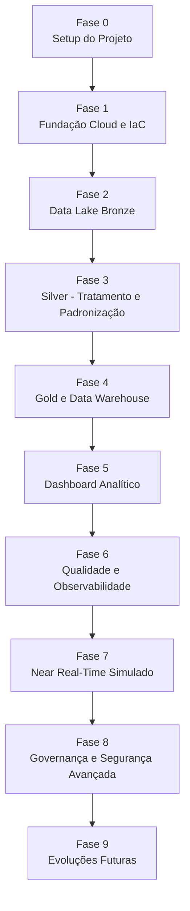

# 🦟 BAIP — Roadmap e TODO de Implementação

> **BAIP — Brazil Arbovirus Intelligence Platform**  
> Roadmap prático para iniciar a implementação da plataforma de dados, partindo da arquitetura e dos ADRs definidos.

---

## 1. Visão geral do roadmap

O objetivo deste roadmap é transformar a arquitetura do BAIP em um plano de execução incremental, começando por um **MVP profissional** e evoluindo para uma arquitetura mais robusta, com boas práticas de segurança, governança, observabilidade, LGPD e escalabilidade.

A recomendação é seguir uma abordagem em camadas:

```text
Fundação → Ingestão → Data Lake → Transformação → DW → Dashboard → Near Real-Time → Governança Avançada
```

---

## 2. Estratégia de implementação

A implementação deve evitar tentar construir tudo ao mesmo tempo.

A ordem ideal é:

1. **Criar a fundação do projeto**
2. **Implementar o Data Lake**
3. **Ingerir uma fonte pública simples**
4. **Criar Bronze, Silver e Gold**
5. **Montar o primeiro indicador analítico**
6. **Publicar o primeiro dashboard**
7. **Adicionar novas fontes**
8. **Adicionar qualidade, observabilidade e governança**
9. **Simular eventos hospitalares near real-time**
10. **Evoluir para arquitetura mais próxima de produção**

---

## 3. Roadmap visual



---

## 4. Roadmap por fases

| Fase | Nome | Objetivo | Resultado esperado |
|---|---|---|---|
| 0 | Setup do Projeto | Organizar repositório, padrões e documentação | Projeto pronto para desenvolvimento |
| 1 | Fundação Cloud e IaC | Criar infraestrutura base na AWS | S3, IAM, KMS, Glue Catalog e Terraform inicial |
| 2 | Bronze Layer | Ingerir dados brutos das fontes públicas | Dados raw versionados no S3 |
| 3 | Silver Layer | Tratar, padronizar e validar dados | Dados limpos e padronizados |
| 4 | Gold/DW | Criar modelo analítico | Fatos, dimensões e indicadores |
| 5 | Dashboard | Disponibilizar consumo analítico | Primeira versão do painel |
| 6 | Observabilidade e Qualidade | Monitorar pipelines e validar dados | Logs, métricas, alarmes e regras de qualidade |
| 7 | Near Real-Time | Simular eventos hospitalares | SQS, Lambda, DynamoDB e DLQ |
| 8 | Governança e Segurança | Reforçar LGPD e boas práticas | PII protegida, catálogo e acesso controlado |
| 9 | Evoluções Futuras | Expandir capacidades da plataforma | API, ML, Iceberg, DR e Multi-Region |

---

# 5. TODO principal

## ✅ Fase 0 — Setup do projeto

### Objetivo

Preparar a estrutura inicial do projeto para que a implementação seja organizada, rastreável e profissional.

### Tarefas

- [ ] Padronizar estrutura de pastas do repositório.
- [ ] Criar ou revisar `README.md`.
- [ ] Criar ou revisar `docs/architecture/what-is-baip.md`.
- [ ] Adicionar os ADRs revisados em `docs/architecture/ADR/`.
- [ ] Criar pasta para diagramas C4.
- [ ] Criar pasta para documentação das fontes de dados.
- [ ] Criar pasta para scripts de ingestão.
- [ ] Criar pasta para jobs de transformação.
- [ ] Criar pasta para Terraform.
- [ ] Definir padrão de nomenclatura dos recursos AWS.
- [ ] Definir tags obrigatórias:
  - `project`
  - `environment`
  - `owner`
  - `cost-center`
  - `data-classification`

### Entregáveis

- [ ] Repositório organizado.
- [ ] Documentação inicial revisada.
- [ ] ADRs padronizados.
- [ ] Estrutura base pronta para desenvolvimento.

---

## ✅ Fase 1 — Fundação Cloud e IaC

### Objetivo

Criar a base mínima da infraestrutura AWS utilizando Terraform.

### Tarefas

- [ ] Criar estrutura inicial do Terraform.
- [ ] Configurar provider AWS.
- [ ] Criar variáveis por ambiente.
- [ ] Criar bucket S3 para Data Lake.
- [ ] Criar estrutura lógica:
  - [ ] Bronze
  - [ ] Silver
  - [ ] Gold
  - [ ] Quarantine
  - [ ] Logs
- [ ] Habilitar versionamento no bucket.
- [ ] Habilitar criptografia SSE-KMS.
- [ ] Criar chave KMS do projeto.
- [ ] Bloquear acesso público ao bucket.
- [ ] Criar roles IAM mínimas para:
  - [ ] Glue
  - [ ] Lambda
  - [ ] Step Functions
  - [ ] Athena
- [ ] Criar Glue Database.
- [ ] Criar Athena Workgroup.
- [ ] Criar CloudWatch Log Groups.
- [ ] Criar orçamento inicial com AWS Budgets.

### Entregáveis

- [ ] Infraestrutura base provisionada.
- [ ] Data Lake criado.
- [ ] Segurança mínima aplicada.
- [ ] Catálogo inicial criado.

---

## ✅ Fase 2 — Bronze Layer

### Objetivo

Implementar a primeira ingestão batch e armazenar dados brutos no S3 Bronze.

### Fonte recomendada para começar

Comece com uma fonte simples e controlada:

```text
Open-Meteo → Bronze
```

Depois evolua para:

```text
NASA EONET → Bronze
IBGE → Bronze
OpenDataSUS → Bronze
```

### Tarefas

- [ ] Criar módulo base de extração.
- [ ] Criar configuração de fontes em Python ou YAML.
- [ ] Implementar cliente para Open-Meteo.
- [ ] Salvar resposta raw no S3 Bronze.
- [ ] Criar padrão de path:

```text
s3://baip-data-lake/bronze/source=<source_name>/entity=<entity_name>/ingestion_date=YYYY-MM-DD/
```

- [ ] Registrar metadados da ingestão:
  - [ ] source
  - [ ] entity
  - [ ] ingestion_timestamp
  - [ ] status
  - [ ] record_count
  - [ ] execution_time
- [ ] Criar log de execução.
- [ ] Criar tratamento de erro simples.
- [ ] Criar primeira execução manual.
- [ ] Validar arquivo no S3.

### Entregáveis

- [ ] Primeira fonte ingerida.
- [ ] Dados raw armazenados na Bronze.
- [ ] Log e métricas básicas de execução.

---

## ✅ Fase 3 — Silver Layer

### Objetivo

Tratar, padronizar e validar os dados brutos.

### Tarefas

- [ ] Criar job de transformação Bronze → Silver.
- [ ] Ler dados raw da Bronze.
- [ ] Definir schema esperado.
- [ ] Padronizar nomes de colunas.
- [ ] Converter tipos de dados.
- [ ] Tratar valores nulos.
- [ ] Remover duplicidades.
- [ ] Criar coluna de controle:
  - [ ] `created_at`
  - [ ] `updated_at`
  - [ ] `source_system`
  - [ ] `ingestion_date`
- [ ] Escrever dados em Parquet.
- [ ] Criar particionamento por data e/ou localidade.
- [ ] Criar regras iniciais de qualidade.
- [ ] Enviar registros inválidos para Quarantine.
- [ ] Registrar tabela no Glue Data Catalog.

### Entregáveis

- [ ] Dados tratados na Silver.
- [ ] Tabela catalogada.
- [ ] Primeiras regras de qualidade aplicadas.
- [ ] Área de quarentena funcionando.

---

## ✅ Fase 4 — Gold Layer e Data Warehouse

### Objetivo

Criar a camada analítica da plataforma.

### Tarefas

- [ ] Definir os principais indicadores do MVP.
- [ ] Definir modelagem dimensional.
- [ ] Criar dimensões:
  - [ ] `dim_municipio`
  - [ ] `dim_estado`
  - [ ] `dim_calendario`
  - [ ] `dim_doenca`
  - [ ] `dim_fonte_dados`
- [ ] Criar fatos:
  - [ ] `fact_casos_arboviroses`
  - [ ] `fact_clima_municipio`
  - [ ] `fact_infraestrutura_saude`
- [ ] Criar agregações analíticas:
  - [ ] casos por município
  - [ ] casos por UF
  - [ ] casos por semana epidemiológica
  - [ ] incidência por 100 mil habitantes
  - [ ] relação casos x chuva
  - [ ] relação casos x temperatura
- [ ] Salvar tabelas em Parquet na Gold.
- [ ] Registrar tabelas no Glue Data Catalog.
- [ ] Criar views no Athena.

### Entregáveis

- [ ] Primeira versão do Data Warehouse.
- [ ] Tabelas fato e dimensão.
- [ ] Indicadores analíticos consultáveis via Athena.

---

## ✅ Fase 5 — Dashboard Analítico

### Objetivo

Disponibilizar uma primeira camada de consumo para análise.

### Tarefas

- [ ] Conectar Power BI ao Athena.
- [ ] Criar dataset analítico.
- [ ] Criar primeira página do dashboard.
- [ ] Criar indicadores principais:
  - [ ] total de casos
  - [ ] casos por doença
  - [ ] casos por UF
  - [ ] casos por município
  - [ ] evolução temporal
  - [ ] incidência por 100 mil habitantes
- [ ] Criar filtros:
  - [ ] ano
  - [ ] UF
  - [ ] município
  - [ ] doença
- [ ] Validar dados do dashboard contra tabelas Gold.
- [ ] Documentar regras dos indicadores.

### Entregáveis

- [ ] Dashboard MVP publicado.
- [ ] Indicadores documentados.
- [ ] Primeira história analítica pronta para apresentação.

---

## ✅ Fase 6 — Qualidade, Observabilidade e Orquestração

### Objetivo

Tornar a plataforma mais confiável, monitorável e próxima de produção.

### Tarefas

- [ ] Criar Step Functions para orquestrar pipelines.
- [ ] Criar agendamento com EventBridge.
- [ ] Criar métricas de execução:
  - [ ] duração
  - [ ] volume de registros
  - [ ] quantidade de erros
  - [ ] registros rejeitados
  - [ ] custo estimado
- [ ] Criar alarmes no CloudWatch.
- [ ] Criar logs estruturados.
- [ ] Criar dashboard operacional.
- [ ] Criar regras de qualidade:
  - [ ] schema obrigatório
  - [ ] campos nulos críticos
  - [ ] duplicidade
  - [ ] volume mínimo esperado
  - [ ] ausência de PII na Gold
- [ ] Criar documentação de troubleshooting.
- [ ] Criar política de reprocessamento.

### Entregáveis

- [ ] Pipeline orquestrado.
- [ ] Logs e métricas disponíveis.
- [ ] Alarmes configurados.
- [ ] Qualidade de dados monitorada.

---

## ✅ Fase 7 — Near Real-Time Simulado

### Objetivo

Simular integração hospitalar com eventos de triagem em tempo quase real.

### Fluxo esperado

```text
Hospital Simulator → SQS → Lambda → DynamoDB → Gold/Reconciliation
```

### Tarefas

- [ ] Criar schema contract do evento de triagem.
- [ ] Criar simulador de eventos hospitalares.
- [ ] Criar fila SQS principal.
- [ ] Criar DLQ.
- [ ] Configurar redrive policy.
- [ ] Criar Lambda consumer.
- [ ] Validar schema do evento.
- [ ] Implementar idempotência por `event_id`.
- [ ] Criar tabela DynamoDB para indicadores recentes.
- [ ] Criar tabela DynamoDB para eventos processados.
- [ ] Adicionar TTL nas tabelas temporárias.
- [ ] Persistir eventos válidos no S3.
- [ ] Enviar eventos inválidos para DLQ ou Quarantine.
- [ ] Criar job de reconciliação batch x near real-time.

### Entregáveis

- [ ] Fluxo near real-time funcionando.
- [ ] Eventos processados com idempotência.
- [ ] DLQ funcionando.
- [ ] DynamoDB com TTL.
- [ ] Base para indicadores recentes.

---

## ✅ Fase 8 — Governança, Segurança e LGPD

### Objetivo

Reforçar controles de segurança, privacidade e governança de dados.

### Tarefas

- [ ] Classificar dados por sensibilidade.
- [ ] Garantir que CPF, nome e identificadores diretos não cheguem na Gold.
- [ ] Implementar tokenização/pseudonimização.
- [ ] Proteger segredos com Secrets Manager.
- [ ] Garantir criptografia com KMS.
- [ ] Revisar IAM com menor privilégio.
- [ ] Criar trilha de auditoria com CloudTrail.
- [ ] Avaliar Lake Formation para controle fino.
- [ ] Documentar política de retenção.
- [ ] Criar lifecycle rules no S3.
- [ ] Criar TTL no DynamoDB.
- [ ] Documentar política de acesso aos dados.
- [ ] Criar data catalog com:
  - [ ] owner
  - [ ] descrição
  - [ ] camada
  - [ ] fonte
  - [ ] classificação
  - [ ] frequência
  - [ ] SLA

### Entregáveis

- [ ] Controles LGPD documentados.
- [ ] PII protegida.
- [ ] Acessos revisados.
- [ ] Catálogo enriquecido.
- [ ] Retenção configurada.

---

## ✅ Fase 9 — Evoluções Futuras

### Objetivo

Expandir a plataforma após o MVP.

### Possíveis evoluções

- [ ] Criar API para consulta de indicadores.
- [ ] Criar modelo de Machine Learning para classificação probabilística de arbovirose.
- [ ] Adotar Apache Iceberg em tabelas críticas.
- [ ] Implementar Lake Formation.
- [ ] Implementar DataHub ou AWS DataZone.
- [ ] Criar lineage automatizado.
- [ ] Adicionar CI/CD completo.
- [ ] Adicionar testes automatizados.
- [ ] Criar ambiente staging.
- [ ] Separar contas AWS por ambiente.
- [ ] Implementar estratégia de Disaster Recovery.
- [ ] Avaliar Multi-Region para produção.
- [ ] Otimizar custo com FinOps.
- [ ] Criar documentação de runbook operacional.

---

# 6. Backlog Kanban

## 🧊 Backlog

- [ ] Adicionar novas fontes do OpenDataSUS.
- [ ] Adicionar dados do IBGE.
- [ ] Adicionar dados de infraestrutura hospitalar.
- [ ] Adicionar NASA EONET.
- [ ] Adicionar modelo de ML.
- [ ] Adicionar API de indicadores.
- [ ] Adicionar Iceberg.
- [ ] Adicionar Lake Formation.
- [ ] Adicionar DataHub/DataZone.

## 🚧 To Do

- [ ] Organizar repositório.
- [ ] Revisar README.
- [ ] Revisar documentação arquitetural.
- [ ] Adicionar ADRs revisados.
- [ ] Criar Terraform base.
- [ ] Criar bucket S3.
- [ ] Criar estrutura Bronze/Silver/Gold.
- [ ] Criar primeira ingestão Open-Meteo.

## 🔨 Doing

- [ ] Escolher primeira fonte.
- [ ] Definir estrutura de pastas.
- [ ] Criar primeiro extractor.
- [ ] Criar primeira escrita Bronze.

## ✅ Done

- [ ] Definição conceitual da arquitetura.
- [ ] Definição dos ADRs.
- [ ] Definição do C4 Context.
- [ ] Definição do C4 Container.
- [ ] Definição do roadmap inicial.

---

# 7. Ordem recomendada para começar amanhã

Se o objetivo é sair da arquitetura e começar a implementar, siga esta ordem:

## Dia 1 — Organização

- [ ] Criar branch `feature/project-structure`.
- [ ] Organizar pastas do projeto.
- [ ] Adicionar README revisado.
- [ ] Adicionar ADRs revisados.
- [ ] Criar pasta `infra/terraform`.
- [ ] Criar pasta `src/ingestion`.
- [ ] Criar pasta `src/processing`.
- [ ] Criar pasta `docs/data-sources`.

## Dia 2 — Terraform base

- [ ] Criar provider AWS.
- [ ] Criar bucket S3.
- [ ] Criar estrutura Bronze/Silver/Gold.
- [ ] Ativar versionamento.
- [ ] Ativar criptografia.
- [ ] Criar Glue Database.
- [ ] Criar Athena Workgroup.

## Dia 3 — Primeira ingestão

- [ ] Criar extractor Open-Meteo.
- [ ] Criar configuração da fonte.
- [ ] Fazer chamada para API.
- [ ] Salvar JSON raw local.
- [ ] Salvar JSON raw no S3 Bronze.
- [ ] Registrar métricas de execução.

## Dia 4 — Primeira Silver

- [ ] Ler dados da Bronze.
- [ ] Padronizar schema.
- [ ] Converter tipos.
- [ ] Salvar Parquet na Silver.
- [ ] Catalogar tabela no Glue.

## Dia 5 — Primeira Gold

- [ ] Criar agregação simples.
- [ ] Criar tabela Gold.
- [ ] Consultar via Athena.
- [ ] Documentar indicador.

## Dia 6 — Dashboard MVP

- [ ] Conectar Power BI no Athena.
- [ ] Criar primeira visualização.
- [ ] Validar números.
- [ ] Documentar regra do indicador.

## Dia 7 — Hardening inicial

- [ ] Adicionar logs estruturados.
- [ ] Adicionar regra de qualidade.
- [ ] Adicionar tratamento de erro.
- [ ] Adicionar documentação do pipeline.
- [ ] Criar primeira versão do runbook.

---

# 8. Estrutura de pastas sugerida

```text
data_masters/
├── README.md
├── docs/
│   ├── architecture/
│   │   ├── what-is-baip.md
│   │   ├── c4/
│   │   │   ├── context.svg
│   │   │   ├── container.svg
│   │   │   └── deployment.svg
│   │   └── ADR/
│   ├── data-sources/
│   │   ├── opendatasus.md
│   │   ├── ibge.md
│   │   ├── open-meteo.md
│   │   └── nasa-eonet.md
│   ├── indicators/
│   │   ├── epidemiological-indicators.md
│   │   └── operational-indicators.md
│   └── runbooks/
│       ├── ingestion-failure.md
│       ├── data-quality-failure.md
│       └── reprocessing.md
├── infra/
│   └── terraform/
│       ├── environments/
│       │   ├── dev/
│       │   ├── staging/
│       │   └── prod/
│       └── modules/
│           ├── s3-data-lake/
│           ├── glue/
│           ├── athena/
│           ├── sqs/
│           ├── lambda/
│           └── dynamodb/
├── src/
│   ├── ingestion/
│   │   ├── sources/
│   │   ├── clients/
│   │   └── jobs/
│   ├── processing/
│   │   ├── bronze_to_silver/
│   │   ├── silver_to_gold/
│   │   └── data_quality/
│   ├── streaming/
│   │   ├── producer/
│   │   ├── consumer/
│   │   └── schemas/
│   └── common/
│       ├── config/
│       ├── logging/
│       ├── metrics/
│       └── aws/
├── tests/
│   ├── unit/
│   ├── integration/
│   └── data_quality/
└── notebooks/
    ├── exploration/
    └── validation/
```

---

# 9. MVP mínimo recomendado

Para não travar no excesso de escopo, o MVP deve ser:

```text
1 fonte pública
→ Bronze
→ Silver
→ Gold
→ Athena
→ Dashboard simples
```

## Fonte recomendada para MVP

```text
Open-Meteo
```

Motivo:

- API simples;
- dados leves;
- fácil validar;
- boa para testar arquitetura;
- útil depois para enriquecer casos de arboviroses.

Depois de validar o fluxo com Open-Meteo, adicionar:

```text
NASA EONET
IBGE
OpenDataSUS
```

---

# 10. Definition of Done do MVP

O MVP pode ser considerado concluído quando:

- [ ] O repositório estiver organizado.
- [ ] A infraestrutura base estiver criada via Terraform.
- [ ] Existir pelo menos uma fonte ingerida na Bronze.
- [ ] Existir transformação Bronze → Silver.
- [ ] Existir transformação Silver → Gold.
- [ ] As tabelas estiverem catalogadas.
- [ ] O Athena consultar os dados.
- [ ] O dashboard exibir pelo menos 3 indicadores.
- [ ] Houver logs de execução.
- [ ] Houver pelo menos 3 regras de qualidade.
- [ ] Houver documentação da fonte.
- [ ] Houver documentação do pipeline.
- [ ] Houver um runbook básico de erro.
- [ ] A arquitetura estiver refletida no C4 Container.

---

# 11. Critérios para evoluir após o MVP

Evoluir para a próxima etapa quando:

- [ ] O pipeline de uma fonte estiver estável.
- [ ] O padrão de ingestão puder ser reaproveitado.
- [ ] A estrutura Bronze/Silver/Gold estiver validada.
- [ ] Os indicadores básicos estiverem confiáveis.
- [ ] O custo estiver controlado.
- [ ] A documentação estiver atualizada.

---

# 12. Priorização sugerida

## Prioridade P0 — Obrigatório para começar

- [ ] Estrutura do projeto
- [ ] Terraform base
- [ ] S3 Data Lake
- [ ] Primeira ingestão
- [ ] Bronze
- [ ] Silver
- [ ] Gold
- [ ] Athena

## Prioridade P1 — Necessário para ficar profissional

- [ ] Glue Catalog
- [ ] Data Quality
- [ ] CloudWatch
- [ ] Step Functions
- [ ] Dashboard
- [ ] ADRs
- [ ] C4 Container
- [ ] Runbooks

## Prioridade P2 — Diferencial arquitetural

- [ ] SQS
- [ ] Lambda
- [ ] DynamoDB
- [ ] DLQ
- [ ] TTL
- [ ] Reconciliation
- [ ] Tokenização/Pseudonimização

## Prioridade P3 — Evolução avançada

- [ ] Lake Formation
- [ ] Apache Iceberg
- [ ] API
- [ ] Machine Learning
- [ ] Multi-Region
- [ ] Disaster Recovery
- [ ] DataHub/DataZone
- [ ] CI/CD avançado

---

# 13. Resumo executivo

O BAIP deve começar simples, mas com base profissional.

A melhor estratégia é implementar primeiro um fluxo batch completo de ponta a ponta:

```text
Open-Meteo → Bronze → Silver → Gold → Athena → Power BI
```

Depois, o projeto deve expandir para mais fontes públicas e, em seguida, adicionar o fluxo hospitalar simulado near real-time:

```text
Hospital Simulator → SQS → Lambda → DynamoDB → Reconciliation → Gold
```

Essa abordagem permite entregar valor rapidamente, validar a arquitetura e evoluir o projeto sem perder controle de custo, complexidade e qualidade.
