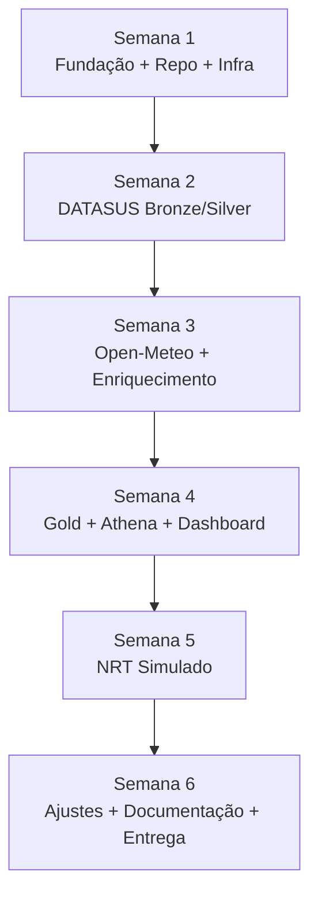

# 🦟 BAIP — Roadmap Leve até 14/08/2026

> **Escopo reduzido do MVP**  
> Fontes: **DATASUS Arboviroses** + **Open-Meteo**  
> Prazo final: **14/08/2026**  
> Objetivo: entregar um case funcional, defendível e bem documentado, sem excesso de escopo.

---

## 1. Objetivo do MVP

Construir uma versão enxuta do **BAIP — Brazil Arbovirus Intelligence Platform**, demonstrando uma plataforma moderna de Engenharia de Dados para análise de arboviroses no Brasil.

O MVP deve integrar:

```text
DATASUS Arboviroses + Open-Meteo
↓
Bronze
↓
Silver
↓
Gold / Data Warehouse
↓
Athena
↓
Dashboard
```

E também simular um fluxo hospitalar near real-time:

```text
Simulador Hospitalar
↓
SQS
↓
Lambda
↓
DynamoDB
↓
DLQ
↓
Persistência / Reconciliação simples
```

---

## 2. Escopo fechado para a entrega

## Dentro do escopo

- [ ] Ingestão batch de dados de arboviroses do DATASUS.
- [ ] Ingestão batch de dados climáticos do Open-Meteo.
- [ ] Data Lake com camadas Bronze, Silver e Gold.
- [ ] Transformações Bronze → Silver.
- [ ] Transformações Silver → Gold.
- [ ] Data Warehouse simples com fatos e dimensões.
- [ ] Consulta via Athena.
- [ ] Dashboard analítico simples.
- [ ] Regras básicas de qualidade.
- [ ] Logs e métricas básicas.
- [ ] Simulador hospitalar de eventos de triagem.
- [ ] SQS + DLQ.
- [ ] Lambda para processar eventos.
- [ ] DynamoDB para estado near real-time.
- [ ] Documentação do projeto.
- [ ] C4 Context e C4 Container atualizados.
- [ ] ADRs revisados.

## Fora do escopo até 14/08

- [ ] Machine Learning.
- [ ] API pública.
- [ ] Apache Iceberg.
- [ ] Lake Formation avançado.
- [ ] Multi-Region.
- [ ] Disaster Recovery completo.
- [ ] DataHub/DataZone.
- [ ] CI/CD avançado.
- [ ] Várias fontes adicionais.
- [ ] Dashboard muito elaborado.
- [ ] Modelagem dimensional muito complexa.

---

## 3. Princípio de entrega

A prioridade é entregar algo que funcione de ponta a ponta.

```text
Funcional > completo
Simples > complexo
Documentado > sofisticado
Entregável > perfeito
```

O MVP deve provar que a arquitetura funciona, mesmo que algumas partes ainda estejam simplificadas.

---

## 4. Roadmap visual



---

# 5. Roadmap por semana

## Semana 1 — 05/07 a 11/07

### Tema

Fundação do projeto.

### Objetivo

Deixar o repositório, documentação e infraestrutura base prontos para começar a implementar.

### Tarefas

- [ ] Organizar estrutura de pastas do repositório.
- [ ] Atualizar `README.md`.
- [ ] Atualizar `docs/architecture/what-is-baip.md`.
- [ ] Adicionar ADRs revisados.
- [ ] Adicionar C4 Context.
- [ ] Adicionar C4 Container.
- [ ] Criar estrutura Terraform.
- [ ] Criar bucket S3 do Data Lake.
- [ ] Criar camadas:
  - [ ] Bronze
  - [ ] Silver
  - [ ] Gold
  - [ ] Quarantine
  - [ ] Logs
- [ ] Criar Glue Database.
- [ ] Criar Athena Workgroup.
- [ ] Habilitar criptografia no S3.
- [ ] Habilitar bloqueio de acesso público.
- [ ] Definir padrão de paths no S3.
- [ ] Criar estrutura base dos módulos Python.

### Entrega da semana

```text
Repositório organizado + infraestrutura mínima + arquitetura documentada
```

---

## Semana 2 — 12/07 a 18/07

### Tema

DATASUS Arboviroses.

### Objetivo

Implementar a ingestão e o tratamento inicial dos dados de arboviroses.

### Tarefas

- [ ] Definir exatamente qual base do DATASUS será usada.
- [ ] Documentar a fonte em `docs/data-sources/datasus-arboviroses.md`.
- [ ] Criar extractor DATASUS.
- [ ] Baixar ou consumir dados de Dengue, Zika e Chikungunya.
- [ ] Salvar dados raw na Bronze.
- [ ] Criar metadados de ingestão:
  - [ ] origem
  - [ ] data de ingestão
  - [ ] quantidade de registros
  - [ ] status da execução
- [ ] Criar transformação Bronze → Silver.
- [ ] Padronizar nomes de colunas.
- [ ] Corrigir tipos de dados.
- [ ] Tratar nulos críticos.
- [ ] Remover duplicidades.
- [ ] Criar coluna `source_system`.
- [ ] Criar coluna `ingestion_date`.
- [ ] Salvar Silver em Parquet.
- [ ] Catalogar tabela no Glue.
- [ ] Validar consulta no Athena.

### Entrega da semana

```text
DATASUS ingerido na Bronze e tratado na Silver
```

---

## Semana 3 — 19/07 a 25/07

### Tema

Open-Meteo e enriquecimento climático.

### Objetivo

Adicionar dados climáticos e cruzar com os dados de arboviroses.

### Tarefas

- [ ] Documentar fonte Open-Meteo em `docs/data-sources/open-meteo.md`.
- [ ] Definir municípios ou coordenadas iniciais do MVP.
- [ ] Criar extractor Open-Meteo.
- [ ] Coletar variáveis climáticas principais:
  - [ ] temperatura
  - [ ] precipitação
  - [ ] umidade, se disponível no recorte escolhido
- [ ] Salvar dados raw na Bronze.
- [ ] Criar transformação Bronze → Silver.
- [ ] Padronizar dados climáticos.
- [ ] Salvar Silver em Parquet.
- [ ] Catalogar tabela no Glue.
- [ ] Criar primeira junção entre arboviroses e clima.
- [ ] Definir granularidade do cruzamento:
  - [ ] município
  - [ ] data
  - [ ] semana epidemiológica, se aplicável
- [ ] Validar dados cruzados no Athena.

### Entrega da semana

```text
Dados climáticos integrados e primeira base enriquecida disponível
```

---

## Semana 4 — 26/07 a 01/08

### Tema

Gold, Data Warehouse e Dashboard.

### Objetivo

Criar a camada analítica e o primeiro dashboard apresentável.

### Tarefas

- [ ] Definir indicadores principais do MVP.
- [ ] Criar dimensões mínimas:
  - [ ] `dim_municipio`
  - [ ] `dim_calendario`
  - [ ] `dim_doenca`
  - [ ] `dim_fonte_dados`
- [ ] Criar fatos mínimas:
  - [ ] `fact_casos_arboviroses`
  - [ ] `fact_clima_municipio`
  - [ ] `fact_casos_clima`
- [ ] Criar camada Gold em Parquet.
- [ ] Catalogar Gold no Glue.
- [ ] Criar views no Athena.
- [ ] Criar queries de validação.
- [ ] Criar dashboard MVP.
- [ ] Criar gráficos:
  - [ ] casos por doença
  - [ ] casos por UF/município
  - [ ] evolução temporal
  - [ ] casos x precipitação
  - [ ] casos x temperatura
- [ ] Documentar regras dos indicadores.

### Entrega da semana

```text
MVP batch completo: DATASUS + Open-Meteo + Gold + Athena + Dashboard
```

---

## Semana 5 — 02/08 a 08/08

### Tema

Near Real-Time simulado.

### Objetivo

Adicionar um fluxo simples de eventos hospitalares para demonstrar arquitetura orientada a eventos.

### Tarefas

- [ ] Criar schema contract do evento de triagem.
- [ ] Criar exemplo de evento JSON.
- [ ] Criar simulador hospitalar.
- [ ] Criar fila SQS principal.
- [ ] Criar DLQ.
- [ ] Criar redrive policy.
- [ ] Criar Lambda consumer.
- [ ] Validar schema do evento.
- [ ] Implementar idempotência por `event_id`.
- [ ] Criar tabela DynamoDB para eventos processados.
- [ ] Criar tabela DynamoDB para indicadores recentes.
- [ ] Adicionar TTL nas tabelas temporárias.
- [ ] Persistir eventos válidos no S3.
- [ ] Enviar eventos inválidos para DLQ.
- [ ] Criar consulta ou relatório simples dos eventos recentes.
- [ ] Documentar o fluxo NRT.

### Entrega da semana

```text
NRT simulado funcionando com SQS + Lambda + DynamoDB + DLQ
```

---

## Semana 6 — 09/08 a 14/08

### Tema

Acabamento final.

### Objetivo

Estabilizar, documentar e preparar a entrega.

### Tarefas

- [ ] Corrigir bugs críticos.
- [ ] Revisar README.
- [ ] Revisar documentação do BAIP.
- [ ] Revisar ADRs.
- [ ] Atualizar C4 Context.
- [ ] Atualizar C4 Container.
- [ ] Atualizar roadmap.
- [ ] Criar documentação das fontes.
- [ ] Criar documentação dos indicadores.
- [ ] Criar documentação do fluxo NRT.
- [ ] Criar runbook simples:
  - [ ] falha na ingestão
  - [ ] falha na qualidade
  - [ ] falha na Lambda
  - [ ] mensagens na DLQ
- [ ] Tirar prints do dashboard.
- [ ] Criar resumo executivo do case.
- [ ] Criar seção “como executar”.
- [ ] Criar seção “decisões arquiteturais”.
- [ ] Criar seção “próximas evoluções”.
- [ ] Fazer teste final ponta a ponta.

### Entrega final

```text
Case pronto para apresentação até 14/08/2026
```

---

# 6. Cronograma resumido

| Semana | Período | Foco | Entrega |
|---|---|---|---|
| 1 | 05/07–11/07 | Fundação | Repo + Infra + Docs |
| 2 | 12/07–18/07 | DATASUS | Bronze/Silver DATASUS |
| 3 | 19/07–25/07 | Open-Meteo | Clima + enriquecimento |
| 4 | 26/07–01/08 | Gold/Dashboard | MVP batch completo |
| 5 | 02/08–08/08 | NRT | SQS + Lambda + DynamoDB |
| 6 | 09/08–14/08 | Finalização | Documentação + apresentação |

---

# 7. Backlog Kanban enxuto

## 🧊 Backlog

- [ ] API de indicadores.
- [ ] Machine Learning.
- [ ] Apache Iceberg.
- [ ] Lake Formation.
- [ ] Multi-Region.
- [ ] DataHub/DataZone.
- [ ] CI/CD avançado.
- [ ] Mais fontes públicas.

## 🚧 To Do

- [ ] Organizar repositório.
- [ ] Criar Terraform base.
- [ ] Criar Data Lake S3.
- [ ] Criar extractor DATASUS.
- [ ] Criar extractor Open-Meteo.
- [ ] Criar Bronze/Silver/Gold.
- [ ] Criar dashboard.
- [ ] Criar fluxo NRT.

## 🔨 Doing

- [ ] Fundação do projeto.
- [ ] Documentação arquitetural.
- [ ] Estrutura dos pipelines.

## ✅ Done

- [ ] Escopo definido.
- [ ] Arquitetura definida.
- [ ] ADRs definidos.
- [ ] C4 Context definido.
- [ ] C4 Container definido.

---

# 8. MVP mínimo aceitável

Se o prazo apertar, o mínimo aceitável para entrega é:

```text
DATASUS Arboviroses
→ Bronze
→ Silver
→ Gold
→ Athena
→ Dashboard simples

Open-Meteo
→ Bronze
→ Silver
→ enriquecimento simples na Gold

Simulador hospitalar
→ SQS
→ Lambda
→ DynamoDB
→ DLQ
```

Com documentação:

- [ ] README.
- [ ] C4 Context.
- [ ] C4 Container.
- [ ] ADRs.
- [ ] Como executar.
- [ ] Fontes de dados.
- [ ] Indicadores.
- [ ] Próximas evoluções.

---

# 9. Indicadores recomendados para o MVP

## Epidemiológicos

- [ ] Total de casos de arboviroses.
- [ ] Casos por doença.
- [ ] Casos por UF.
- [ ] Casos por município.
- [ ] Evolução temporal de casos.
- [ ] Casos por semana epidemiológica.

## Climáticos

- [ ] Temperatura média por município/data.
- [ ] Precipitação acumulada.
- [ ] Casos x temperatura.
- [ ] Casos x precipitação.

## Operacionais simulados

- [ ] Eventos hospitalares recebidos.
- [ ] Eventos processados.
- [ ] Eventos enviados para DLQ.
- [ ] Atendimentos suspeitos por doença.
- [ ] Indicadores recentes no DynamoDB.

---

# 10. Estrutura de pastas recomendada

```text
data_masters/
├── README.md
├── docs/
│   ├── architecture/
│   │   ├── what-is-baip.md
│   │   ├── c4/
│   │   │   ├── context.svg
│   │   │   └── container.svg
│   │   └── ADR/
│   ├── data-sources/
│   │   ├── datasus-arboviroses.md
│   │   └── open-meteo.md
│   ├── indicators/
│   │   └── baip-indicators.md
│   └── runbooks/
│       ├── ingestion-failure.md
│       ├── lambda-failure.md
│       └── dlq-redrive.md
├── infra/
│   └── terraform/
│       ├── environments/
│       │   └── dev/
│       └── modules/
│           ├── s3-data-lake/
│           ├── glue/
│           ├── athena/
│           ├── sqs/
│           ├── lambda/
│           └── dynamodb/
├── src/
│   ├── ingestion/
│   │   ├── datasus/
│   │   └── open_meteo/
│   ├── processing/
│   │   ├── bronze_to_silver/
│   │   ├── silver_to_gold/
│   │   └── data_quality/
│   ├── nrt/
│   │   ├── producer/
│   │   ├── consumer/
│   │   └── schemas/
│   └── common/
│       ├── config/
│       ├── logging/
│       └── aws/
├── tests/
│   ├── unit/
│   └── data_quality/
└── notebooks/
    └── validation/
```

---

# 11. Ordem prática para começar

## Primeiro bloco

- [ ] Criar branch.
- [ ] Organizar repo.
- [ ] Subir docs e ADRs.
- [ ] Criar Terraform base.
- [ ] Criar S3 Bronze/Silver/Gold.

## Segundo bloco

- [ ] Implementar DATASUS.
- [ ] Salvar Bronze.
- [ ] Transformar Silver.
- [ ] Catalogar.
- [ ] Consultar Athena.

## Terceiro bloco

- [ ] Implementar Open-Meteo.
- [ ] Salvar Bronze.
- [ ] Transformar Silver.
- [ ] Cruzar com DATASUS.
- [ ] Criar Gold.

## Quarto bloco

- [ ] Criar dashboard.
- [ ] Criar indicadores.
- [ ] Documentar regras.

## Quinto bloco

- [ ] Criar SQS.
- [ ] Criar Lambda.
- [ ] Criar DynamoDB.
- [ ] Criar DLQ.
- [ ] Criar simulador.
- [ ] Testar evento válido e inválido.

## Sexto bloco

- [ ] Revisar tudo.
- [ ] Documentar.
- [ ] Criar prints.
- [ ] Preparar apresentação.

---

# 12. Definition of Done

O projeto estará pronto para entrega quando:

- [ ] DATASUS estiver ingerido na Bronze.
- [ ] DATASUS estiver tratado na Silver.
- [ ] Open-Meteo estiver ingerido na Bronze.
- [ ] Open-Meteo estiver tratado na Silver.
- [ ] Gold tiver pelo menos uma tabela analítica integrada.
- [ ] Athena conseguir consultar os dados.
- [ ] Dashboard tiver pelo menos 4 visualizações.
- [ ] NRT conseguir processar evento válido.
- [ ] Evento inválido for para DLQ.
- [ ] DynamoDB armazenar indicador recente ou estado do evento.
- [ ] README explicar o projeto.
- [ ] C4 Context e Container estiverem atualizados.
- [ ] ADRs estiverem versionados.
- [ ] Fontes de dados estiverem documentadas.
- [ ] Indicadores estiverem documentados.
- [ ] Próximas evoluções estiverem claras.

---

# 13. Sugestão de esforço

Para esse escopo reduzido, a estimativa fica mais realista:

| Bloco | Estimativa |
|---|---:|
| Setup + docs + infra | 12–20h |
| DATASUS Bronze/Silver | 14–24h |
| Open-Meteo Bronze/Silver | 8–14h |
| Gold + Athena + Dashboard | 14–24h |
| Qualidade/logs básicos | 6–12h |
| NRT simulado | 16–28h |
| Documentação final | 8–14h |

Total estimado:

```text
78 a 136 horas
```

Com o prazo até 14/08, isso exige aproximadamente:

```text
14 a 24 horas por semana
```

---

# 14. Resumo executivo

O escopo reduzido é viável até 14/08/2026.

A entrega deve focar em:

```text
DATASUS Arboviroses + Open-Meteo
↓
Lakehouse Medallion
↓
Gold/DW
↓
Athena/Dashboard
↓
NRT simulado com SQS, Lambda, DynamoDB e DLQ
```

A prioridade é ter um projeto funcional, bem documentado e fácil de explicar.

Evite adicionar novas tecnologias antes de concluir o fluxo principal.
